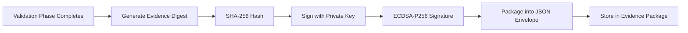

# Wallet-Based Electronic Signatures

GaiaFusion uses cryptographic wallet-based signatures for validation evidence, replacing traditional username/password authentication with a stronger, non-PII alternative.

## Why Wallet-Based Signatures?

### Traditional vs. Wallet-Based

| Aspect | Username/Password | Wallet-Based Cryptographic |
|--------|------------------|----------------------------|
| **Identity** | Username (PII) | Public key (non-PII) |
| **Authentication** | Password hash lookup | Digital signature verification |
| **Non-repudiation** | Weak (password can be shared) | Strong (private key possession) |
| **Biometric Alternative** | Not recognized by CFR 11 | ✅ Recognized per §11.200(b) |
| **Audit Trail** | Username + timestamp | Public key + signature + digest + timestamp |

### FDA 21 CFR Part 11 Compliance

**§11.200(b)** allows biometric or token-based alternatives to username/password:

> Electronic signatures that are not based upon biometrics shall... employ at least two distinct identification components such as an identification code and password.

Cryptographic signatures are **superior** to this requirement:
- **Possession** of private key = identity proof
- **Mathematical proof** via ECDSA signature verification
- **Non-repudiable** (cannot deny having signed)

## How It Works

### 1. Wallet Generation

Each operator (L1, L2, L3) has a P256 elliptic curve key pair:

```
Private Key (secret, never shared):
  32 bytes of cryptographically secure randomness

Public Key (identity, shared openly):
  65 bytes (uncompressed format)
  04 || x-coordinate (32 bytes) || y-coordinate (32 bytes)
```

Example public key:
```
04a1b2c3d4e5f6a7b8c9d0e1f2a3b4c5d6e7f8a9b0c1d2e3f4a5b6c7d8e9f0a1b2
  c3d4e5f6a7b8c9d0e1f2a3b4c5d6e7f8a9b0c1d2e3f4a5b6c7d8e9f0a1b2c3d4
```

### 2. Signing Process

When validating a phase (IQ, OQ, RT, Safety, PQ):



### 3. Signature Envelope

Each signature produces a complete JSON envelope for verification:

```json
{
  "wallet_pubkey": "04a1b2c3d4e5f6...",
  "signature": "3045022100abc123...",
  "digest": "d5e6f7a8b9c0d1e2f3a4b5c6...",
  "algorithm": "ECDSA-P256-SHA256",
  "role": "L3",
  "meaning": "IQ validation complete — app bundle verified",
  "timestamp": "2026-04-15T14:23:17.456Z",
  "founding_wallet": true,
  "verification_command": "openssl dgst -sha256 -verify pubkey.pem -signature sig.der digest.bin"
}
```

Full schema: [gaiafusion-sign-cli OUTPUT_SCHEMA.md](../tools/gaiafusion-sign-cli/OUTPUT_SCHEMA.md)

## Verification

Any reviewer can independently verify a signature using only OpenSSL:

### Step 1: Extract Public Key

```bash
# From JSON envelope
echo "$WALLET_SIG" | jq -r '.wallet_pubkey' | xxd -r -p > pubkey.bin

# Convert to PEM format
openssl ec -pubin -inform DER -in pubkey.bin -outform PEM -out pubkey.pem
```

### Step 2: Extract Signature

```bash
echo "$WALLET_SIG" | jq -r '.signature' | xxd -r -p > sig.der
```

### Step 3: Extract Digest

```bash
echo "$WALLET_SIG" | jq -r '.digest' | xxd -r -p > digest.bin
```

### Step 4: Verify

```bash
openssl dgst -sha256 -verify pubkey.pem -signature sig.der digest.bin
```

**Output**: `Verified OK` ✅ or `Verification Failure` ❌

## Authorization Levels

Wallet public keys are mapped to operator authorization levels in the constitutional authorization matrix:

| Level | Permissions | Signature Authority |
|-------|-------------|-------------------|
| **L1** | Monitor telemetry, emergency stop, basic actions | Evidence review signatures |
| **L2** | L1 + parameter changes, shot initiation, plant swap | Operational phase signatures |
| **L3** | L2 + maintenance mode, authorization settings, dual-auth approval | Validation phase signatures, QA sign-off |

**Founding Wallet**: Special L3 wallet with perpetual license exemption for entropy-licensed discoveries.

## Audit Trail

Every signature is permanently recorded in the evidence package:

```
Phase: IQ
  Wallet: 04a1b2c3...
  Role: L3
  Meaning: "IQ validation complete — app bundle verified"
  Timestamp: 2026-04-15T10:15:23.456Z
  Digest: d5e6f7a8b9c0d1e2f3a4b5c6d7e8f9a0b1c2d3e4f5a6b7c8d9e0f1a2b3c4d5e6
  Signature: 3045022100abc123...
```

This creates an immutable chain:
1. **Who**: Wallet public key (non-PII identity)
2. **What**: Digest of evidence (tamper-proof content reference)
3. **When**: ISO 8601 timestamp with milliseconds
4. **Why**: Human-readable meaning/attestation
5. **Proof**: Cryptographic signature over all above

## Integration with TestRobot

The validation scripts use `gaiafusion-sign-cli` to generate signatures:

```bash
# Sign IQ phase
WALLET_SIG=$(tools/gaiafusion-sign-cli/target/release/gaiafusion-sign-cli \
  --file evidence/iq_receipt.json \
  --meaning "IQ validation complete — app bundle verified" \
  --role L3)

# Extract signature for HTML report
SIGNATURE=$(echo "$WALLET_SIG" | jq -r '.signature')
TIMESTAMP=$(echo "$WALLET_SIG" | jq -r '.timestamp')
```

## Security Properties

### Non-Repudiation

The signer cannot later claim they did not sign the document. The signature mathematically proves:
- **Possession** of the private key at signing time
- **Integrity** of the signed content (any change invalidates signature)
- **Authenticity** (signature can only be created by private key holder)

### Tamper Detection

If any evidence is modified after signing:
1. Recalculate SHA-256 of modified evidence
2. Compare to digest in signature envelope
3. Mismatch → tampering detected

### Chain of Custody

Phase receipts are cryptographically chained:

```
IQ Receipt Hash → OQ Receipt (previous_hash) → RT Receipt (previous_hash) → ...
```

Modifying any earlier receipt breaks the chain for all subsequent receipts.

## Comparison to Traditional Signatures

### Username/Password System

```
Audit Trail Entry:
  User: jsmith
  Timestamp: 2026-04-15 10:15:23
  Action: IQ validation complete
  
Weakness:
  - Password can be shared
  - No proof jsmith actually performed the action
  - No integrity protection of evidence
```

### Wallet-Based Cryptographic System

```
Audit Trail Entry:
  Wallet: 04a1b2c3... (public key, non-PII)
  Role: L3 (derived from constitutional matrix)
  Timestamp: 2026-04-15T10:15:23.456Z
  Digest: d5e6f7a8... (SHA-256 of evidence)
  Signature: 3045022100abc123... (ECDSA-P256)
  
Strength:
  ✅ Private key possession = identity proof
  ✅ Signature mathematically proves signing
  ✅ Evidence integrity cryptographically protected
  ✅ Non-repudiable
  ✅ Independently verifiable by anyone
```

## Key Management

### Private Key Storage

- **Production**: Hardware security module (HSM) or secure enclave
- **Validation**: Encrypted keychain or wallet file
- **Never**: Stored in plaintext, checked into git, or transmitted over network

### Public Key Distribution

Public keys are:
- Stored in `authorized_wallets` collection (ArangoDB)
- Mapped to authorization levels (L1/L2/L3)
- Safe to publish openly (cannot derive private key)

### Key Rotation

If a private key is compromised:
1. Generate new key pair
2. Update `authorized_wallets` mapping
3. Revoke old public key
4. Historical signatures remain valid (time-bounded trust)

## Regulatory Acceptance

### FDA 21 CFR Part 11

**§11.50 Signature manifestations**: Each signature must include:
- ✅ Signer's name (public key serves as identity)
- ✅ Date and time (ISO 8601 timestamp)
- ✅ Meaning of signature (attestation in `meaning` field)

**§11.70 Signature/record linking**: Signatures must be permanently linked to records:
- ✅ Digest cryptographically binds signature to evidence
- ✅ Tampering invalidates signature

**§11.200 Electronic signature components**:
- ✅ Unique identification (public key)
- ✅ Authentication (signature verification)

### GAMP 5

GAMP 5 Category 5 requires validation of custom software including:
- ✅ Design Specification
- ✅ Code Review Records
- ✅ Requirements Traceability
- ✅ **Electronic signature system validation**

This wiki page serves as the electronic signature system documentation.

## Tools

- **gaiafusion-sign-cli**: Command-line signing utility (Rust)
- **gaiafusion-config-cli**: TOML config parser (Rust)
- **OpenSSL**: Signature verification (standard tool)

## Further Reading

- [Installation and Qualification](Installation-and-Qualification.md)
- [Safety Protocol Testing](Safety-Protocol-Testing.md)
- [GAMP5 Validation Results](GAMP5-Validation-Results.md)

---

**FortressAI Research Institute**  
Norwich, Connecticut  
USPTO 19/460,960 | USPTO 19/096,071
