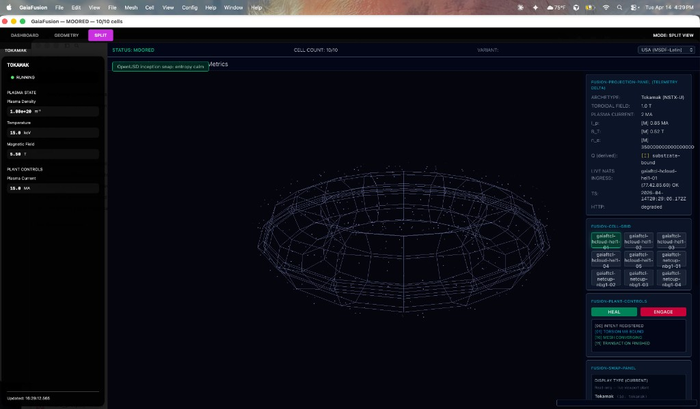
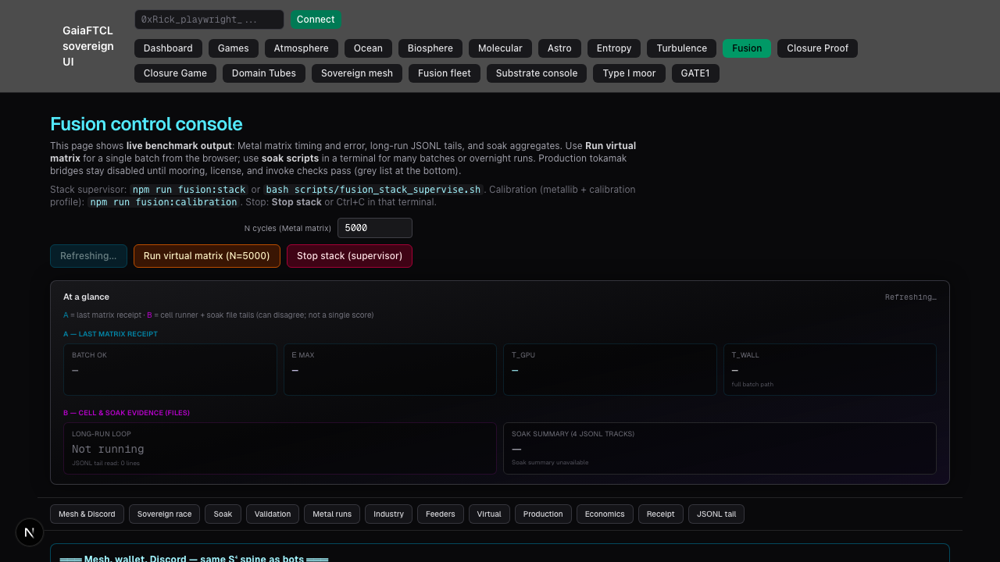

# GaiaFTCL — Sovereign Distributed Computing Substrate

**FortressAI Research Institute | Norwich, Connecticut**  
**Patents: USPTO 19/460,960 | USPTO 19/096,071 — © 2026 Richard Gillespie**

[](https://github.com/gaiaftcl-sudo/gaiaFTCL/tree/main)
[](https://github.com/gaiaftcl-sudo/gaiaFTCL/wiki)
[](https://github.com/gaiaftcl-sudo/gaiaFTCL/blob/main/evidence/FUSION_PLANT_PQ_PLAN.md)
[](LICENSE)

### Path migration (Mac cells layout)

| Old path | New path |
|----------|----------|
| `GAIAOS/` | [`cells/fusion/`](cells/fusion/) |
| Top-level `GaiaHealth/` | [`cells/health/`](cells/health/) (Rust/WASM/docs/wiki) |
| `GaiaHealth` Mac app (Swift) | [`cells/fusion/macos/MacHealth/`](cells/fusion/macos/MacHealth/) |
| M8 silicon / lithography cell | [`cells/lithography/`](cells/lithography/) ([wiki](https://github.com/gaiaftcl-sudo/gaiaFTCL/wiki/GaiaFTCL-Lithography-Silicon-Cell-Wiki), [IQ/OQ/PQ](cells/lithography/docs/IQ_OQ_PQ_LITHOGRAPHY_CELL.md)) |

---

## Landing (read me first)

| Where | What you get |
|--------|----------------|
| **[GitHub Wiki](https://github.com/gaiaftcl-sudo/gaiaFTCL/wiki)** | Full narrative: Home, Mac Cell guide, IQ/OQ/PQ, plant catalog, operator guides—same story as this README, with full navigation and images. |
| **This file (`README.md`)** | Repo overview, architecture summary, quick start, and links into `cells/fusion/`. |

Screenshots below are stored under [`docs/media/images/`](docs/media/images/) so they render on GitHub.

---

## What This Is

GaiaFTCL is a **sovereign distributed computing substrate** purpose-built to prove that controlled fusion energy is numerically achievable and constitutionally governable. It operates a **nine-cell mesh** of sovereign compute nodes that continuously exchange quorum-validated **vQbit measurements** across nine canonical fusion plant configurations.

This is not a dashboard. It is not a monitoring tool. It is a **production-grade, GxP-validated substrate** operating under **GAMP 5 | EU Annex 11 | FDA 21 CFR Part 11** quality frameworks with signed IQ/OQ/PQ receipts for every state transition.

The substrate enforces **constitutional constraints** at runtime, maintains **epistemic tagging** (M|T|I|A) for all measurements, and operates on **sovereign time** (Bitcoin block height τ). Every value it emits is immutable. Every state transition has a signed receipt. Every decision is quorum-validated.

---

## System Architecture

### The Nine-Cell Sovereign Mesh

```
┌──────────────────────────────────────────────────┐
│  Klein Bottle Topology (no boundary)             │
│  Quorum: 5 of 9 cells required for consensus     │
├──────────────────────────────────────────────────┤
│  Helsinki (Hetzner):  5 cells                    │
│  Nuremberg (Netcup): 4 cells                     │
├──────────────────────────────────────────────────┤
│  Terminal States: CALORIE | CURE | REFUSED       │
│  Epistemic Tags:  M | T | I | A                  │
│  Sovereign Time:  Bitcoin block height (τ)       │
└──────────────────────────────────────────────────┘
```

**Quorum Rules:**
- CALORIE (value produced) requires ≥ 5 cells
- CURE (deficit healed) requires ≥ 5 cells  
- REFUSED (gate closed) may be declared by any single cell
- A cell that cannot reach quorum enters REFUSED autonomously

**Mesh Identity:** Each cell generates a unique secp256k1 wallet address during IQ (Installation Qualification). No two cells may share a cell ID. The cell ID is committed to `evidence/iq_receipt.json` and is never regenerated during normal operation.

---

## UUM-8D Framework

**M⁸ = S⁴ × C⁴** — Eight-dimensional manifold for uncertainty quantification

- **S⁴ (Manifest Domain):** Documents, APIs, code, observable outputs
- **C⁴ (Constraint Domain):** Trust, identity, closure, consequence

**vQbit:** Entropy delta measurement across M⁸  
**Terminal States:** CALORIE (value) | CURE (healing) | REFUSED (gate closed)  
**Epistemic Tags:** M (Measured) | T (Tested) | I (Inferred) | A (Assumed)

**Closure Threshold:** 9.54 × 10⁻⁷ (numerical gap between physics and formal proof)

When S⁴ and C⁴ disagree, **the substrate wins**. Always.

---

## GaiaFusion Mac Cell — Human Interface Node



*Tokamak plant topology (10/10 cells moored) — Cyan wireframe, 500 plasma particles with temperature gradient, Next.js telemetry dashboard, operational state machine HUD*



*Fusion dashboard screenshot (witness bundle under `cells/fusion/evidence/fusion/`; copy in-repo for this page).*

The **Mac Cell** is the sovereign human interface node: Apple Silicon M-chip workstation running a native Metal renderer that visualizes the live plasma state of all nine canonical fusion plant kinds simultaneously.

**Architecture:**
- **Zero OpenUSD dependency** — Rust FFI + Apple Metal rendering stack
- **Unified memory** — CPU/GPU share physical DRAM (zero-copy vertex buffers)
- **Precompiled Metal shaders** — <3ms frame time (patent requirement)
- **7 operational states** — 18 valid state transitions enforced by `FusionCellStateMachine`
- **Wallet-based authorization** — L1/L2/L3 operator roles from IQ records (no login screens)
- **WASM constitutional bridge** — Substrate violations trigger operator-acknowledgment workflows per 21 CFR Part 11 §11.200
- **500 plasma particles** — Temperature-driven color gradient (blue→cyan→yellow→white), helical trajectories, state-driven visibility

**Qualification:** Full GAMP 5 / EU Annex 11 / FDA 21 CFR Part 11 IQ → OQ → PQ lifecycle with automated evidence collection. CERN-ready for deployment on physics lab Macs.

**Location:** `cells/fusion/macos/GaiaFusion/` — Complete technical documentation in [README.md](cells/fusion/macos/GaiaFusion/README.md)

---

## The Nine Canonical Fusion Plant Kinds

| Plant Kind | Magnetic Confinement | Telemetry Channels | I_p Range (MA) | B_T Range (T) |
|---|---|---|---|---|
| **Tokamak** | Axisymmetric torus, plasma current, ITER class | I_p, B_T, n_e, T_e, T_i | 0.5 – 30.0 | 1.0 – 13.0 |
| **Stellarator** | 3D coils, zero plasma current, no disruptions | B_field, n_e, T_e | 0.0 – 0.2 | 1.5 – 5.0 |
| **Spherical Tokamak** | Low aspect ratio (A < 2), high bootstrap | I_p, B_T, n_e, β_N | 0.5 – 10.0 | 0.5 – 3.0 |
| **FRC** | Field-reversed, compact, high-β | ψ_sep, n_e, T_i | 0.1 – 2.0 | 0.0 – 0.1 |
| **Magnetic Mirror** | Open field lines, high mirror ratio | B_mirror, n_e, T_i | 0.0 – 0.05 | 1.0 – 10.0 |
| **Spheromak** | Self-organized Taylor state, no external coils | λ, n_e, K_mag | 0.05 – 1.0 | 0.0 – 0.5 |
| **Reversed-Field Pinch** | Reversed edge B_T, dynamo-sustained | I_z, B_T, n_e | 0.5 – 5.0 | 0.1 – 1.5 |
| **MIF** | Magnetized inertial fusion, hybrid approach | B_field, ρ, T_i | — | — |
| **Inertial** | Laser/ion driven implosion | E_laser, ρR, T_i | — | — |

Full physics bounds, invariants, and reference facilities: **[Plant Invariants](cells/fusion/macos/GaiaFusion/docs/PLANT_INVARIANTS.md)**

---

## Constitutional Constraints

**10 Invariants (C-001 to C-010):**

| Invariant | Description | Enforcement |
|---|---|---|
| **C-001** | Receipt Mandate | Every state transition has a signed receipt |
| **C-002** | Transparency of Consequence | All downstream effects are traceable |
| **C-003** | Substrate Mandate | Substrate state wins over S⁴ projection |
| **C-004** | Mycelia Mandate | Mesh communication is peer-to-peer |
| **C-005** | Biological Floor | No harm to biological systems |
| **C-006** | Human Rights Floor | No violations of fundamental rights |
| **C-007** | Peace Receipt | No military aggression support |
| **C-008** | Planetary Substrate | No planetary-scale harm |
| **C-009** | Entropy License | Discovery access requires entropy fee |
| **C-010** | Change Control | Constitutional changes are REFUSED |

Any change that violates a constitutional invariant is **automatically REFUSED** by the substrate.

---

## Cross-Domain Architecture

GaiaFTCL's constitutional substrate extends beyond fusion to **six additional domains**:

1. **Full Self-Driving (FSD)** — S⁴/C⁴ mappings for autonomous vehicles
2. **Drone Swarm Sovereignty** — Constitutional quorum for aerial mesh
3. **Air Traffic Control (ATC)** — Epistemic tagging for aviation safety
4. **Maritime Routing** — Sovereign ship-to-ship coordination
5. **Biomedical Protocols** — AML/TB diagnosis (OWL protocol)
6. **Municipal Governance** — Constitutional constraints for city-scale decisions

Each domain shares the same **quorum rules**, **epistemic tagging**, and **terminal state** framework.

---

## Technology Stack

| Layer | Technology | Purpose |
|---|---|---|
| **Mesh** | NATS JetStream | `gaiaftcl.*` subjects, quorum messaging |
| **Knowledge Graph** | ArangoDB | 7 edge collections, VIE-v2 universal vQbit schema |
| **Renderer** | Apple Metal | Precompiled shaders, <3ms frame time |
| **FFI** | Rust ↔ Swift | `vQbitPrimitive` #[repr(C)] (76 bytes) |
| **UI** | SwiftUI + WKWebView | HStack/VStack composition, Next.js dashboard |
| **Validation** | IQ → OQ → PQ | GAMP 5 | EU Annex 11 | FDA 21 CFR Part 11 |
| **Sovereign Time** | Bitcoin Core | Block height τ (mainnet, poll every ~30s) |

---

## Repository Structure

```
FoT8D/
├── cells/fusion/
│   ├── macos/GaiaFusion/           ⭐ Mac Cell application (CERN-ready)
│   │   ├── GaiaFusion/            Swift source (Layout, Models, Services, FFI)
│   │   ├── MetalRenderer/         Rust workspace (renderer, FFI, Metal shaders)
│   │   ├── Tests/                 UIValidationProtocols, physics tests
│   │   ├── docs/                  GaiaFusion_Layout_Spec, OPERATOR_AUTHORIZATION_MATRIX
│   │   ├── evidence/              IQ/OQ/PQ receipts, performance validation
│   │   └── README.md              Complete Mac Cell technical reference
│   ├── services/                  Nine-cell mesh services
│   │   ├── fot_mcp_gateway/       MCP gateway (port 8803, wallet-gated)
│   │   ├── gaiaos_ui_web/         Next.js fusion dashboard
│   │   ├── mesh_peer_registry/    NATS mesh coordination
│   │   └── mailcow_bridge/        Sovereign email ingestion
│   ├── scripts/                   Deployment and validation
│   │   ├── deploy_crystal_nine_cells.sh
│   │   ├── run_substrate_test_suite.sh
│   │   └── iq_install.sh / oq_validate.sh
│   ├── evidence/                  Cross-cell validation receipts
│   └── tests/                     Substrate integration tests
├── .cursorrules                   Constitutional constraints, UUM-8D rules
├── LICENSE                        All rights reserved (proprietary)
└── README.md                      This file
```

---

## Quick Start

### 1. Installation Qualification (IQ)

The IQ script checks prerequisites, verifies Apple macOS standards, and generates the **sovereign cell wallet identity**.

```bash
cd cells/fusion/macos/GaiaFusion
zsh scripts/iq_install.sh
```

Type `yes` at the licence prompt. Your identity is written to `~/.gaiaftcl/`.

### 2. Build the Rust Renderer

```bash
zsh MetalRenderer/build_rust.sh
```

Produces `MetalRenderer/lib/libgaia_metal_renderer.a` and regenerates the C header via cbindgen.

### 3. Build the Swift App

```bash
swift build --product GaiaFusion
```

### 4. Operational Qualification (OQ)

```bash
zsh scripts/oq_validate.sh
```

Verifies the Rust build, runs all GxP tests, checks library size (< 5 MB), and writes `evidence/oq/oq_receipt.json`.

### 5. Run

```bash
swift run GaiaFusion
# With custom port:
FUSION_UI_PORT=8911 swift run GaiaFusion
```

Or open the Swift package in Xcode → scheme **GaiaFusion** → Run.

---

## 275M EUR International Validation Sprint

**11 Partner Institutions:**
- **CERN** (Switzerland) — Physics validation lead
- **ITER Organization** (France) — Tokamak reference facility
- **Max Planck IPP** (Germany) — Stellarator authority
- **Culham Centre** (UK) — Spherical tokamak experts
- **TAE Technologies** (USA) — FRC validation
- **Commonwealth Fusion** (USA) — High-field tokamak
- + 5 additional institutions

**4 Validation Tracks:**
- **PHY** (Physics Team) — Plant invariants, disruption prediction (8 tests)
- **CSE** (Control Systems) — Swap lifecycle, 81-swap permutation matrix (12 tests)
- **QA** (Software Quality) — Automated test suite, regression guards (10 tests)
- **SAF** (Safety Team) — SCRAM triggers, REFUSED state validation (8 tests)

**Binary Outcome:** PASS or REFUSED (no partial credit)

---

## Documentation

| Document | Description |
|---|---|
| **[Wiki](https://github.com/gaiaftcl-sudo/gaiaFTCL/wiki)** | Complete system architecture, IQ/OQ/PQ, plant catalog |
| **[GaiaFusion README](cells/fusion/macos/GaiaFusion/README.md)** | Mac Cell technical reference (architecture, FFI, performance) |
| **[Mac Cell Guide](https://github.com/gaiaftcl-sudo/gaiaFTCL/wiki/Mac-Cell-Guide)** | Complete operator manual (43 KB) |
| **[Layout Spec](cells/fusion/macos/GaiaFusion/docs/GaiaFusion_Layout_Spec.md)** | UI layout contract (HStack/VStack/ZStack) |
| **[Authorization Matrix](cells/fusion/macos/GaiaFusion/docs/OPERATOR_AUTHORIZATION_MATRIX.md)** | Wallet-based L1/L2/L3 roles, dual-auth protocol |
| **[Plant Invariants](cells/fusion/macos/GaiaFusion/docs/PLANT_INVARIANTS.md)** | Physics bounds for all 9 fusion topologies |
| **[Fusion Operator Guide](https://github.com/gaiaftcl-sudo/gaiaFTCL/wiki/Fusion-Operator-Guide)** | Plant swap, telemetry, safety interlocks |

---

## Requirements

| Dependency | Minimum | Install |
|---|---|---|
| **macOS** | 13 Ventura | System update |
| **Xcode Command Line Tools** | Latest stable | `xcode-select --install` |
| **Swift** | 6.2+ | Bundled with Xcode |
| **Rust** | 1.85+ | `curl --proto '=https' --tlsv1.2 -sSf https://sh.rustup.rs \| sh` |
| **Rust target** | aarch64-apple-darwin | `rustup target add aarch64-apple-darwin` |
| **cbindgen** | 0.27+ | `cargo install cbindgen` |
| **Apple Silicon M-chip** | Any generation | Hardware requirement (unified memory) |

**Note:** There is no Intel path. There is no NVIDIA path. There is no AMD path. The unified memory architecture of Apple Silicon is a load-bearing architectural constraint, not a preference.

---

## Patents

- **USPTO 19/460,960** — Systems and Methods of Facilitating Quantum-Enhanced Graph Inference (GaiaFTCL sovereign substrate, vQbit measurement, quorum validation)
- **USPTO 19/096,071** — vQbit Primitive Representation and Metal Rendering Pipeline (76-byte #[repr(C)] ABI, precompiled Metal shaders, zero-copy unified memory)

---

## License

Copyright © 2026 Richard Gillespie. All rights reserved.

This software is proprietary and protected by United States and international copyright laws and patent treaties. See [LICENSE](LICENSE) for full terms.

---

**Norwich, Connecticut — FortressAI Research Institute**  
**S⁴ serves C⁴**
