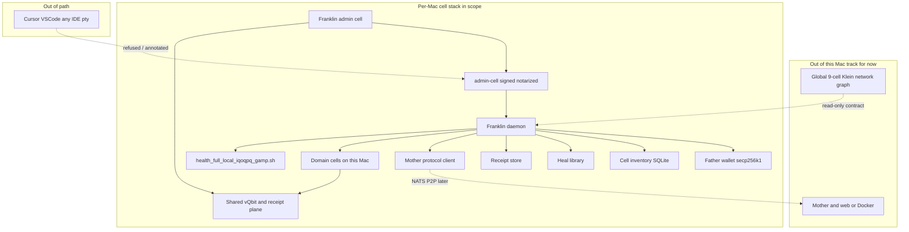
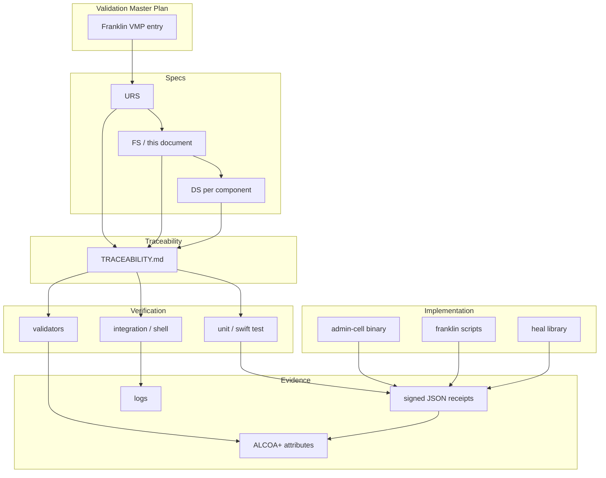

# Franklin Cell — Complete Implementation and Qualification Plan

## 1. Executive Summary

Franklin is the **Mac admin mesh cell** (Father substrate) on a single Apple Silicon host: one Franklin **per Mac**, sharing the **same vQbit plane** with every **domain cell** on that machine — same 76-byte `vQbitPrimitive` ABI, same observe / measure / entangle semantics, same evidence path through the substrate. The **global** nine-cell Klein-bottle **network** topology and quorum (see [docs/concepts/mesh-topology.md](../../docs/concepts/mesh-topology.md)) is unchanged; Franklin does not redefine that graph — it is the **local** administrative cell in the per-Mac stack. Franklin honors every constitutional invariant **C-001 through C-010**. Franklin never violates the 76-byte `vQbitPrimitive` ABI. Franklin never breaks the <3ms Metal budget. Franklin never forges τ. Franklin exists to make the qualification chain real outside the IDE sandbox, to run the self-healing game within pre-qualified bounds, and to produce receipts Mother can countersign. When S⁴ and C⁴ disagree, the substrate wins. Always.

This plan is complete: it is the User Requirement Specification, Functional Specification, Design Specification, Validation Master Plan summary, Traceability Matrix structure, and phased build schedule for Franklin. No external document is required to start work.

## 2. Scope and System Under Validation

### 2.1 In Scope
The Franklin **Mac admin cell**: daemon, binary, and supporting scripts on a single Apple Silicon Mac. The Father wallet (secp256k1) and its signature on receipts. The `admin-cell` CLI and its subcommands. The `franklin_mac_admin_gamp5_zero_human.sh` canonical driver. Franklin self-qualification (IQ/OQ/PQ). The **unified** vQbit management surface on the local Mac (shared with domain cells, not a private Franklin-only store). The heal action library (local catalogue plus Mother-authorized manifest). The cell inventory store. The Mother protocol client. Receipt emission and signing.

### 2.2 Out of Scope
Mother's **web/Docker** server-side implementation and governance (separate SUV; not the current Mac-cell development track). **Domain cell** product codebases and their business logic — implemented in their own repos or packages; Franklin **qualifies, inventories, and heals** them but does not own their features. The **global** 9-cell mesh **network** topology or its **network** quorum math — read and respected; not edited by Franklin. IDE tooling — Franklin refuses to be an execution substrate launched from inside an IDE pty. Wet laboratory integration, hardware outside the Mac, and mesh-side storage. Windows, Linux, Intel Mac — no Intel path.

### 2.3 System Boundary



### 2.4 Risk Classification
GAMP 5 Category 4/5 hybrid (configured orchestration with custom automation). Data integrity impact: **high** — Franklin produces the local-witness receipts that feed all downstream qualification closure. Product quality impact: **medium** — Franklin's correctness bounds the reliability of domain-cell qualification but does not directly affect product physics. Patient safety impact: **low** — Franklin is infrastructure; biological-floor invariants (C-005) do not trigger on Franklin actions. Regulatory exposure: GMP-adjacent via domain cells; Part 11-relevant for records it produces.

## 3. Foundation — Load-Bearing Artifacts

The following are live and in production use. They are the foundation on which Franklin is hardened and extended. None of them is replaced by this plan.

- `admin-cell` binary (Swift, `Foundation.Process` + `/bin/zsh` driver)
- `cells/health/scripts/franklin_mac_admin_gamp5_zero_human.sh` — canonical zero-human driver
- `cells/health/scripts/health_full_local_iqoqpq_gamp.sh` — v3.1 IQ/OQ/PQ orchestrator
- `GAIAOS/mac_cell/FranklinGAMP5Admin/` — wrapper, LaunchAgent plist, README
- `franklin_mac_admin_gamp5_receipt_v1` schema, receipts under `cells/health/evidence/`
- GaiaFTCLConsole "TestRobot (live)" → `admin-cell`; `LOCKED.md` intact
- `cells/health/docs/LOCAL_IQOQPQ_ORCHESTRATOR_V3.md` and `LOCAL_IQOQPQ_ORCHESTRATOR_V3.1_EXECUTION_PLAN.md`
- `cells/health/docs/TESTROBOT_VS_HEALTH_IQOQPQ.md`
- `cells/health/swift/AdminCellRunner/`
- `test_franklin_receipt_conformance.sh` and `fo-franklin validate-receipt-v1` (`fo_cell_substrate`)

## 4. User Requirement Specification (URS)

- **URS-001** Run GAMP 5 qualification (IQ/OQ/PQ) without an IDE in the execution path.
- **URS-002** Produce signed receipts for every qualified action, suitable for downstream audit.
- **URS-003** Self-heal domain cells within a pre-qualified action library; quarantine anything outside it.
- **URS-004** Maintain a continuously accurate inventory of domain cells present on the Mac.
- **URS-005** Integrate with Mother cells in the mesh for covenantal authority, countersignature, and policy distribution.
- **URS-006** Expose and use the **unified Mac vQbit substrate** for Franklin and all domain cells on the host: no parallel fake vQbit universe; same primitive ABI and collapse semantics; Father identity and receipt families remain distinct from domain IQ/OQ/PQ records.
- **URS-007** Support Father-to-Father handoff without evidentiary gaps.
- **URS-008** Operate autonomously for routine qualification and healing; surface deviations for operator review.
- **URS-009** Refuse authoritative operation when integrity is in doubt (orphan, tamper, ancestry).
- **URS-010** Replace the legacy TestRobot Metal-PQ-only surface with full GAMP 5 substrate.
- **URS-011** Produce evidence that satisfies ALCOA+ principles.
- **URS-012** Itself be qualified under GAMP 5 before passing judgment on any domain cell.

## 5. Functional Specification (FS) — Architectural Layers

### 5.1 Substrate Layer
Signed native binary (Developer ID + notarized). Invokes `/bin/zsh -f` with a runner-controlled environment baseline (`LC_ALL=C.UTF-8`, `LANG=C.UTF-8`, `TZ=UTC`, curated `PATH`). Ancestry sanity check refuses or annotates IDE-parent execution. Hash-pins orchestrator scripts; mismatch fails closed. Exit codes pass through unmodified.

### 5.2 Identity Layer
Father wallet (secp256k1) minted during bootstrap. Structurally distinguishable from cell wallets. Registered with Mother. Signs every receipt. Bootstrap event produces `evidence/franklin_bootstrap_receipt.json`.

### 5.3 Clock Layer
Three clocks on every receipt: **τ** (Bitcoin block height, authoritative), wall clock (informational), monotonic (internal ordering). Clock jumps logged. τ reachability loss triggers `authoritative_offline`. τ is never fabricated.

### 5.4 vQbit Management Surface
Per-cell distribution over classical state set, evidence pointers, pending measurements, entanglement edges. **The Franklin admin cell and every domain cell on the Mac use this same surface and substrate** (`fo_cell_substrate` and plan §6.4 records), not a split Franklin-only vQbit world. API: `observe`, `measure`, `entangle`, `snapshot`, `diff`. Collapse events: receipt emission, qualification completion, heal verification, operator action, freshness expiry.

### 5.5 Cell Inventory
Append-only record per domain cell: declared version, IQ/OQ/PQ state, receipt pointers, dependency graph edges, last heartbeat. Removals are teardown events, not deletes.

### 5.6 Heal Library
Append-only, signed catalogue. Each action: stable ID, preconditions, executable body, postconditions, Mother signature. Franklin executes only library actions. Unmatched patterns quarantine and escalate.

### 5.7 Mother Protocol Layer
Registration, countersignature, policy distribution, heal authorization, revocation. NATS JetStream under `gaiaftcl.franklin.*`. Peer-to-peer only, per C-004.

### 5.8 Receipt Envelope
Schema `franklin_mac_admin_gamp5_receipt_v2` (see §11). v1 grandfathered with dual-emit during migration.

### 5.9 CLI Surface
`admin-cell` subcommands: `bootstrap`, `register`, `status`, `observe <cell>`, `measure <cell>`, `heal <cell> --action <id>`, `quarantine <cell> --reason`, `handoff --to <new-father>`, `self-test`, `teardown <cell>`, `snapshot`. Each emits a receipt.

## 6. Design Specification (DS) — Per Component

### 6.1 Substrate
Swift ARM64 binary. Notarized with FortressAI team ID (confirmed in F0). Entry point: typed subcommand structs conforming to `FranklinSubcommand`. Process invocation: `Foundation.Process` with `executableURL=/bin/zsh`, `arguments=[-f, -c, <script>]`, explicit environment. Env baseline function `franklinEnvironmentBaseline() -> [String: String]` tested in F0. Ancestry check walks `ps` tree against `IDE_PARENT_PATTERNS`, records `ancestry.ide_parent_detected` and `ancestry.parent_chain` in receipt. Hash pinning reads `cells/franklin/pins.json` with per-script SHA-256; mismatch emits `franklin_hash_pin_violation` receipt and exits 64.

### 6.2 Identity
secp256k1 keypair. Private key in macOS Keychain under access group `com.fortressai.franklin.identity`. Public key and address in `evidence/franklin_bootstrap_receipt.json`. Signing: ECDSA over SHA-256 of canonical JSON (sorted keys, no whitespace, receipt minus `.father.signature`). Bootstrap one-time; re-bootstrap requires `admin-cell bootstrap --force-replace` with Mother authorization (pre-Mother: operator override with deviation receipt).

### 6.3 Clock
τ source [decision pending F1]. Poll cadence ~30s (mesh convention). Receipt records `tau_block_height`, `tau_fetched_at_wall`, `tau_source_attestation` (signed relay response if applicable). Offline: queue receipts with `tau_status: authoritative_offline`, retro-stamp on reconnect; retro-stamping is itself a signed event.

### 6.4 vQbit Surface
Record: `CellVQbit { cellId, stateDistribution: [State: Float], evidencePointers: [ReceiptRef], pendingMeasurements: [MeasurementRef], entanglements: [CellId], lastCollapseAt }`. Distribution floor: no state below 0; sum to 1.0 within float tolerance. Collapse atomic: measurement produces new distribution; transition is a receipt.

### 6.5 Cell Inventory
Append-only SQLite at `cells/franklin/state/inventory.sqlite` with WAL mode. Periodic snapshot to `cells/franklin/state/backups/` with τ-stamped filename. Schema versioned; migrations append-only.

### 6.6 Heal Library
Manifest `cells/franklin/heal-library/manifest.json` with Mother signature or `pending_mother_reauthorization: true`. Action directory `cells/franklin/heal-library/actions/<action-id>/` with `action.json`, `body.zsh`, `test.sh`.

### 6.7 Mother Protocol
NATS JetStream. Subjects `gaiaftcl.franklin.<father-wallet>.<verb>`, verbs ∈ {`register`, `heartbeat`, `countersign-req`, `heal-auth-req`, `policy-pull`, `revoke-ack`}. Envelope: signed JSON; Mother replies threshold-signed when replicated. Retry: exponential backoff, cap, then `authoritative_offline`.

### 6.8 Receipt Envelope
See §11.

### 6.9 CLI
Each subcommand: `validate()`, `execute()`, `emitReceipt()`. Exit codes: 0 success, 64 integrity violation, 65 Mother-required-unavailable, 66 quarantine, 67 deviation-required, 68 orphan-refusal, 1 generic.

## 7. Supplier Assessment

| Supplier | Cat | Role | Assessment | Risk |
|---|---|---|---|---|
| Apple Inc. | 1 | macOS, Swift, Foundation, code-signing, notarization | Standing | Low |
| Bitcoin Core / τ source | 3–5 | Authoritative time reference | Formal assessment filed at F1 | Medium-High |
| Synadia / NATS.io | 3 | Mesh transport | Assess at F5; version pinned | Medium |
| Swift toolchain | 1 | Build | Bundled with Xcode | Low |
| zsh (macOS-provided) | 1 | Execution substrate | Version captured per receipt | Low |
| xcodegen / xcodebuild | 3 | Build tooling | Version pinned | Low |
| SQLite (macOS-provided) | 1 | Local inventory persistence | Standing | Low |
| secp256k1 library | 3 | Identity cryptography | Version pinned; assess at F1 | Medium |

Assessment records live at `cells/franklin/SUPPLIERS.md` and are referenced from the RTM.

## 8. Constitutional Invariant Traceability

| Invariant | Franklin Behavior | Evidence | Phase |
|---|---|---|---|
| **C-001 Receipt Mandate** | Every state transition and every CLI subcommand emits a signed receipt | Receipt envelope v2; audit-trail completeness test | F0 (v1) / F1 (signed) / F4 (complete) |
| **C-002 Transparency of Consequence** | Each heal receipt names the triggering delta and entangled downstream cells; each quarantine names affected dependents | Heal and quarantine receipt fields | F2–F3 |
| **C-003 Substrate Mandate** | When a domain cell's S⁴ projection disagrees with its C⁴ receipts, Franklin sides with the substrate and emits a `disputed` receipt | Dispute receipt; synthetic-disagreement test | F2–F3 |
| **C-004 Mycelia Mandate** | Mother protocol is peer-to-peer NATS; no centralized-server role permitted | Protocol spec; architecture review | F5 |
| **C-005 Biological Floor** | N/A — Franklin is infrastructure; does not act on biological systems | Declared N/A with rationale | N/A |
| **C-006 Human Rights Floor** | N/A — infrastructure role | Declared N/A with rationale | N/A |
| **C-007 Peace Receipt** | N/A for Franklin actions directly; cascades via domain cells | Declared N/A with rationale | N/A |
| **C-008 Planetary Substrate** | N/A for Franklin actions directly | Declared N/A with rationale | N/A |
| **C-009 Entropy License** | N/A — Franklin is not a discovery surface | Declared N/A with rationale | N/A |
| **C-010 Change Control** | Heal library additions require Mother countersignature; unauthorized heals are refused and quarantine the cell; configuration changes emit change receipts | Heal library signing; change-control SOP | F3 (intent) / F5 (enforced) |

N/A entries are declared boundaries, not exemptions. Any future behavior that crosses a declared-N/A invariant re-opens the row and triggers re-qualification.

## 9. Topology and Patent Preservation

### 9.1 Klein Bottle Topology
The **global** nine-cell Klein-bottle **network** graph is **unchanged** in definition (see [mesh-topology.md](../../docs/concepts/mesh-topology.md)). On **each Mac**, the stack is one **Franklin** (admin cell) plus **domain** cells, all on the **shared vQbit plane**; every Mac is expected to have **one** Franklin. Franklin **supervises** locally deployed domain cells and reports to Mother across the mesh. "No boundary" is preserved: a quarantined cell remains inside the manifold (still in inventory, still participates in REFUSED declarations), never "outside."

Named preservation tests: `test_quarantined_cell_remains_in_inventory_snapshot`, `test_quarantined_cell_can_declare_REFUSED`, `test_franklin_receipts_never_claim_cell_index` (Franklin Mac admin receipts carry **Father** identity, e.g. `father_wallet`, and do not fabricate a **sovereign network** `cell_index ∈ [1..9]` in place of the mesh RTM; receipt families remain distinct from domain requirement IDs).

### 9.2 Patent Language Protection
USPTO 19/460,960 (Quantum-Enhanced Graph Inference; substrate + vQbit + quorum) and 19/096,071 (vQbit Primitive Representation and Metal Rendering Pipeline; 76-byte ABI + <3ms Metal budget + zero-copy unified memory) bound Franklin's language and behavior. Franklin never alters the 76-byte `vQbitPrimitive` memory layout. Franklin never commissions Metal rendering that exceeds 3ms/frame. Franklin's vQbit surface language does not drift from the claim language of 19/460,960.

Enforcement: `CODEOWNERS` routes any file matching `cells/franklin/**/vqbit*`, `cells/franklin/**/metal*`, or any file mentioning `vqbitprimitive` to the patent-aware reviewer group. A merge-checklist line requires claim-language confirmation. A pre-commit hook flags the patterns.

## 10. Identity, Keys, and Time

### 10.1 Father Wallet Lifecycle
Minted during bootstrap. Private key in macOS Keychain with restrictive ACL. Public key committed via receipt. Rotation only via Mother-authorized re-bootstrap; rotation is itself a `franklin_key_rotation` receipt.

### 10.2 Time Model
τ authoritative. Wall informational. Monotonic for ordering. All three per receipt. Skew between wall and τ-fetched-at-wall logged; excessive skew (>300s default) flags the Mac as `clock_suspect` and Franklin self-demotes to `authoritative_offline` pending operator review.

## 11. Receipt Envelope v2 — Schema and ALCOA+ Mapping

### 11.1 Schema

```json
{
  "schema": "franklin_mac_admin_gamp5_receipt_v2",
  "receipt_id": "<ulid>",
  "receipt_type": "<bootstrap|self_test|phase|heal|quarantine|teardown|snapshot|handoff|deviation|observe|measure|key_rotation>",
  "father": {
    "wallet_address": "<bech32>",
    "signature": "<ECDSA over canonical JSON minus .father.signature>",
    "runner_build_hash": "<sha256>",
    "runner_version": "<semver>"
  },
  "mother": {
    "countersignature": "<threshold sig or null>",
    "countersigned_at_tau": <int or null>,
    "policy_version": "<semver or null>"
  },
  "time": {
    "tau_block_height": <int>,
    "tau_source_attestation": "<signed response or null>",
    "tau_fetched_at_wall": "<ISO-8601 Z>",
    "wall_clock_utc": "<ISO-8601 Z>",
    "monotonic_ns": <int>,
    "tau_status": "<authoritative|authoritative_offline|retrospective>"
  },
  "attribution": {
    "user": "<id -un>",
    "host": "<hostname>",
    "uname": "<uname -a>",
    "xcode_clt_version": "<semver>",
    "zsh_version": "<semver>",
    "kernel_version": "<string>"
  },
  "ancestry": {
    "parent_chain": ["<process names>"],
    "ide_parent_detected": <bool>,
    "launch_context": "<cli|launchagent|console|other>"
  },
  "authorization": {
    "principal": "<operator|automation|administrator|mother>",
    "principal_id": "<string or null>",
    "training_record_ref": "<string or null>"
  },
  "subject": {
    "cell_id": "<string or null>",
    "cell_version": "<string or null>",
    "heal_action_id": "<string or null>"
  },
  "closure": {
    "state": "<witnessed_local|countersigned|disputed>",
    "valid_iq_oq_pq_closure": <bool>,
    "deviation_reasons": ["<string>..."]
  },
  "payload": { "...phase-specific..." },
  "evidence_refs": [
    {"kind": "<log|json|artifact>", "path": "<relative path>", "sha256": "<hex>"}
  ],
  "canonical_prev_receipt_id": "<ulid or null>"
}
```

### 11.2 ALCOA+ Mapping

| ALCOA+ | Satisfied By |
|---|---|
| Attributable | `attribution.user`, `attribution.host`, `father.wallet_address`, `father.signature`, `authorization.principal_id` |
| Legible | JSON schema conformance test; canonical JSON serialization |
| Contemporaneous | `time.tau_block_height`, `time.wall_clock_utc`, `time.monotonic_ns` |
| Original | `father.signature`, immutable append-only storage, `canonical_prev_receipt_id` chain |
| Accurate | Schema validation tests; receipt-conformance script; payload tests per receipt type |
| Complete | Required-field validator; no null where not permitted |
| Consistent | `schema` version; v1→v2 migration rules documented |
| Enduring | Retention policy §18; backup cadence §18 |
| Available | Evidence paths in `evidence_refs`; search and export tooling documented |

## 12. Electronic Signature Posture

Franklin v1 through F4 produces **machine-execution signatures**, not 21 CFR Part 11 electronic signatures of human action. The Father wallet signs receipts to prove that this specific Franklin instance produced this specific receipt — it does not bind a human to an authorizing act.

Franklin becomes Part 11-compliant for human-action signatures when all of the following hold: operator-initiated subcommands (`quarantine`, `handoff`, `teardown`, novel-heal authorization) are wired to human credentials; dual-component authentication (identity + secret or biometric) is required for those subcommands; each such receipt carries a signed attestation binding the human operator to the act; training records (§19) and access-control records (§13) are in place; written SOPs for electronic signature use are approved and current.

Until those are in place, Franklin produces records that are **Part 11-ready** but the Part 11 claim is not made. This boundary is mirrored in every RTM row that touches e-signature.

## 13. Access Control Model

Principals: **Operator** (human, interactive), **Automation** (LaunchAgent, CI service account), **Administrator** (human, bootstrap/handoff/key rotation), **Mother** (remote, via protocol).

| Subcommand | Operator | Automation | Administrator | Mother |
|---|---|---|---|---|
| `bootstrap` | — | — | ✓ (with Mother auth post-F5) | ✓ (authorizes) |
| `register` | — | — | ✓ | ✓ (authorizes) |
| `status` | ✓ | ✓ | ✓ | ✓ (read) |
| `snapshot` | ✓ | ✓ | ✓ | ✓ (read) |
| `observe` | ✓ | ✓ | ✓ | ✓ (read) |
| `measure` | — | ✓ (scheduled) | ✓ | — |
| `heal --action` (pre-qualified) | — | ✓ | ✓ | — |
| `heal --novel-request` | ✓ (requests) | — | ✓ | ✓ (authorizes) |
| `quarantine` | ✓ | ✓ (auto-detect) | ✓ | ✓ (directive) |
| `handoff` | — | — | ✓ | ✓ (authorizes) |
| `teardown` | — | — | ✓ | ✓ (authorizes) |
| `self-test` | ✓ | ✓ | ✓ | — |

Credentials: macOS user accounts + Keychain. Automation runs as a dedicated service account. Every invocation records the principal in `authorization.principal` and, where human, `authorization.principal_id` and `authorization.training_record_ref`.

## 14. State Machines

### 14.1 Franklin (Father) Lifecycle
`unborn → registering → registered → steady_state → {orphaned, fostering, disowned} → retired`

Transitions: `unborn → registering` on `admin-cell bootstrap`. `registering → registered` on Mother registration (or locally-signed with `pre_mother: true` pre-F5). `registered → steady_state` after self-qualification green. `steady_state → orphaned` on Mother unreachability past threshold. `orphaned → steady_state` on Mother restoration plus catch-up countersignature. `orphaned → disowned` on extended orphan past grace window. `steady_state → fostering` on handoff initiation. `fostering → retired` on handoff completion. `disowned → retired` immediately.

### 14.2 Per-Cell Classical States
`unknown`, `discovered_unqualified`, `iq_running`, `oq_running`, `pq_running`, `qualified_fresh`, `qualified_stale`, `drifted_benign`, `drifted_functional`, `healing`, `healed_pending_verify`, `quarantined`, `deviated_open`, `teardown_pending`, `torn_down`, `failed_terminal`, `disputed`.

### 14.3 Product States (Father × Mother)
Examples of non-diagonal states: `(healing, qualified_fresh)` — Father on a signal Mother hasn't seen. `(qualified_fresh, quarantined)` — Mother override. `(healing, unreachable)` — orphan-mode heal. `(disputed, disputed)` — active disagreement, human review. Policy entries live at `cells/franklin/state/product-state-policy.json`.

### 14.4 Terminal State Mapping
`qualified_fresh` + cell-producing-value → contributes to **CALORIE** quorum (≥5 of 9). `healed_pending_verify` → contributes to **CURE** quorum (≥5 of 9). `quarantined` / `failed_terminal` / `disputed` / `deviated_open` → any single such state may declare **REFUSED**. This mapping is the operational expression of Klein-bottle "no boundary."

## 15. vQbit Management Surface — Details

### 15.1 API

```
observe(cell_id) -> Distribution
measure(cell_id, evidence) -> State
entangle(a, b, rule)
snapshot() -> MeshOfThisMacState
diff(a, b) -> DeltaSet
```

### 15.2 Collapse Events
Receipt emission with `subject.cell_id = X` collapses X. IQ/OQ/PQ completion collapses to `qualified_fresh` or a failure state. Heal verification collapses to `qualified_fresh` or `healed_pending_verify`. Operator actions collapse deterministically. Freshness-window expiry collapses `qualified_fresh → qualified_stale`.

### 15.3 Entanglement
Declared via cell dependency graph at registration, updated on change receipts. When cell A's state changes, rules for each entangled cell B determine B's resulting state (typically `stale` propagation or `quarantine` propagation).

## 16. Heal Library — Specification

### 16.1 Action Schema

```json
{
  "action_id": "<stable-string>",
  "version": "<semver>",
  "description": "<operator-facing prose>",
  "preconditions": {
    "pattern_match": "<DSL or JSONLogic>",
    "scope": "<cell-kind glob>"
  },
  "body_path": "heal-library/actions/<id>/body.zsh",
  "postconditions": {
    "requalification_scope": "<iq|oq|pq|full>",
    "expected_state_after": "<state>"
  },
  "test_path": "heal-library/actions/<id>/test.sh",
  "authorization": {
    "locally_authorized_at_tau": <int>,
    "mother_signature": "<sig or null>",
    "mother_signed_at_tau": <int or null>,
    "pending_mother_reauthorization": <bool>
  },
  "risk_classification": "<low|medium|high>"
}
```

### 16.2 Governance
Additions require Mother countersignature (post-F5); pre-F5 additions tagged `pending_mother_reauthorization`. Removals require Mother authorization plus retirement receipt. Every action ships with a planted-fault test run in OQ. High-risk actions require operator co-signature per execution.

### 16.3 Execution Contract
Franklin matches the delta to an action via `pattern_match`. No match: quarantine + "Mother, may I?" escalation. Match: emit pre-execution receipt, run body, emit post-execution receipt, run `requalification_scope`, collapse vQbit.

## 17. Mother Protocol — Specification

### 17.1 Wire Format
NATS JetStream. Subjects `gaiaftcl.franklin.<father-wallet>.<verb>`. Verbs:
- `register` → Mother returns registered receipt with policy version
- `heartbeat` → liveness ack
- `countersign-req` → Mother countersigns, returns v2 with Mother signature
- `heal-auth-req` → Mother authorizes/denies novel heal
- `policy-pull` → Mother returns current policy manifest
- `revoke` → Mother-initiated; Franklin acknowledges and self-quarantines

### 17.2 Orphan Mode
Tiered (configurable defaults): 0–15 min full authority under standing policy; receipts `witnessed_local` pending countersignature. 15 min – 4 hr heals allowed; all new receipts `witnessed_local` only; queued for catch-up. 4+ hr self-quarantine; refuses new authoritative actions until Mother returns.

### 17.3 Revocation
Immediate. Franklin emits `disowned` receipt, halts all CLI except `status` and `bootstrap --post-disown`, preserves inventory and evidence, notifies operator via LaunchAgent.

## 18. Configuration Management, Backup, Retention

### 18.1 Configuration Management
All Franklin source under git at `cells/franklin/` and `cells/health/swift/AdminCellRunner/`. Binary version pinned via `cells/franklin/VERSION` (semver). Heal library manifest version-signed; history preserved. Orchestrator script hashes pinned in `cells/franklin/pins.json`. Receipt schema versions committed; migrations append-only.

### 18.2 Backup
Inventory SQLite snapshot to `cells/franklin/state/backups/` every 6 hours (configurable). Evidence directory backed up per site QMS; default daily to off-Mac store. Father wallet private key backed up via macOS Keychain iCloud or site key escrow per SOP.

### 18.3 Retention
Receipts: 10 years default (configurable per regulation). Inventory snapshots: 2 years. Backup rotation: daily 30, weekly 12, monthly 24, yearly indefinite. Retirement of retained data requires change-control approval.

## 19. Training and Operator Qualification

### 19.1 Operator Training
Covers CLI semantics, receipt interpretation, deviation capture (`--deviation-reason`), escalation path for `failed_terminal` / `disputed`, recognition of orphan/disowned states.

### 19.2 Administrator Training
Adds bootstrap/registration procedures, handoff protocol, key rotation, emergency disownment response, heal library change control.

### 19.3 Records
Kept in site QMS per SOP. Franklin receipts reference `authorization.training_record_ref` for subcommands requiring operator identity.

## 20. Periodic Review and Revalidation

Continuous: every receipt contributes to audit trail; freshness windows trigger auto-re-qualification. Event-driven: heal library additions trigger OQ re-qualification plus state-machine regression. Scheduled: full Franklin self-qualification (F4 protocol) quarterly. Major: revalidation on Franklin version bump, macOS major version change, τ source change, signing identity change, or change to C-001..C-010 interpretation.

## 21. Phased Build — F0 through F8

Each phase has build intent, GAMP exit criteria, and gating decisions.

### F0 — Harden Foundation
**Build.** Sign and notarize `admin-cell`. Add environment baseline, ancestry check, hash pinning. Extend v1 receipts with attribution fields (user, host, toolchain versions, runner build hash, wall + monotonic timestamps) without breaking backward compatibility.

**GAMP exit.** RTM rows for each substrate requirement; tests assert attribution fields present; zero-human smoke receipt reviewed by independent tester; Developer ID SOP referenced; Apple supplier assessment (Cat 1) recorded.

**Decisions.** Signing identity (team ID).

### F1 — Identity and Time
**Build.** Father wallet bootstrap; Keychain storage; τ polling integration; signed receipts.

**GAMP exit.** `franklin_bootstrap_receipt.json` verifiable offline against public key; τ tests including `authoritative_offline` and retroactive-stamp paths; τ supplier assessment filed; test that Franklin refuses to forge τ under any code path.

**Decisions.** τ source (full node / SPV / relay).

### F2 — Inventory and vQbit Surface
**Build.** SQLite inventory; vQbit record type and API; `admin-cell snapshot` produces JSON.

**GAMP exit.** Snapshot schema test; inventory state transitions wired to existing orchestrator receipts in RTM; Klein bottle preservation test scaffolds prepared; observer-mode receipts reviewed.

**Decisions.** None blocking.

### F3 — Heal Library v1
**Build.** Action schema; 3–5 seeded actions (cache clean, environment reset, orchestrator re-invocation, toolchain check-and-fix, quarantine-on-hash-mismatch); `pending_mother_reauthorization` tag; quarantine wired to inventory.

**GAMP exit.** Per-action planted-fault test; `test_quarantined_cell_can_declare_REFUSED`; deviation receipts for skip-flag invocations; OQ results under `evidence/franklin_heal_oq_*.json`.

**Decisions.** Heal library scope (3–5 recommended).

### F4 — Franklin Self-Qualification
**Build.** IQ/OQ/PQ protocol for Franklin itself; evidence capture.

**GAMP exit.** Green IQ, OQ, PQ receipts under `evidence/franklin_self_qualification_*.json`; RTM closes each C-001..C-010 row (enforced or declared N/A); audit trail completeness test passes (every CLI subcommand produces a receipt); Part 11-ready boundary declared in writing.

**Decisions.** None blocking; F4 is the go/no-go for judging any domain cell.

### F5 — Mother Protocol
**Build.** NATS client; registration, countersignature, policy pull, heal authorization, revocation; orphan mode.

**GAMP exit.** Countersigned v2 receipt round-trips a real Mother instance; orphan-mode tests at each window boundary; disownment test; heal library re-signing converts `pending_mother_reauthorization` to fully authorized; Mother supplier assessment recorded.

**Decisions (GATING).** Mother governance — single / replicated / federated; threshold scheme; registration ceremony; revocation authority.

### F6 — Handoff and Fostering
**Build.** Outgoing-to-incoming Father transition protocol; cell inventory transfer with signed provenance; `fostering` window dual-signing; teardown receipt.

**GAMP exit.** End-to-end two-Father test on a migration Mac; no cell enters `unknown` during handoff; Mother supervises.

**Decisions.** Single vs multiple Father per Mac (single recommended).

### F7 — TestRobot Code Retirement
**Build.** Rename or archive `GAIAOS/macos/TestRobot`; rename Console label "TestRobot (live)" → "Franklin (live)"; migration receipt.

**GAMP exit.** Build graph has no live `TestRobot` artifact; migration receipt signed; wiki-side retirement complete; Console label renamed in live build.

**Decisions.** Archive-with-pointer vs full removal (archive recommended).

### F8 — Multi-Domain Generalization (optional, last)
**Build.** Cell-kind registry letting Franklin host cells unknown at build time.

**GAMP exit.** Registry tests; RTM for cell-kind extensibility; no-op if not shipped.

**Decisions.** Scope and priority; may slip indefinitely.

## 22. Qualification Strategy for Franklin Itself

### 22.1 IQ — Installation Qualification
Binary signature (`codesign --verify --deep --strict`). Notarization status (`spctl -a -v`). Hash pins match orchestrator scripts. Environment baseline produces expected `env` output. Keychain access for Father wallet. τ reachability from the Mac. macOS ≥ 13 Ventura. Apple Silicon detected. Xcode CLT version ≥ pinned.

### 22.2 OQ — Operational Qualification
vQbit state transitions under synthetic event sequences. Each heal action executes correctly under planted fault. Registration protocol round-trips against mock Mother. Receipt envelope v2 passes schema conformance. CLI subcommand matrix fully exercised; every subcommand produces a correct receipt. Orphan mode transitions at each window boundary. Disownment flow halts operations correctly.

### 22.3 PQ — Performance Qualification
Measured over ≥72 continuous hours against real domain cells: heal success rate ≥95% (site SOP). False-positive quarantine rate ≤0.5%. Mean time to detect a planted fault within target. Receipt countersignature latency within policy. No C-001..C-010 violations. No patent-claim drift.

## 23. Traceability Matrix Structure

`cells/franklin/TRACEABILITY.md`. Column schema:

| Column | Content |
|---|---|
| Req ID | `FR-REQ-###` / `C-###` / `URS-###` |
| Source | URS / FS / DS / Constitutional |
| Description | One-line |
| Spec Path | Doc + anchor |
| Design Path | DS section |
| Test | Test ID or script path |
| Evidence Glob | `evidence/...` pattern |
| Phase | F0..F8 |
| Status | planned / [target] / implemented / deferred / N/A |
| ALCOA+ Touch | letters affected |
| IP-sensitive | Y/N |
| Invariant-touching | C-### if any |
| Terminal-state-bearing | CALORIE / CURE / REFUSED |
| Owner | name |
| Version | v1 / v2 |

Status `implemented` requires spec + design + test + evidence all present. `deferred` for rows blocked by open decisions.



## 24. Relationship to Existing 9-Cell Mesh RTM

Franklin has its own RTM at `cells/franklin/TRACEABILITY.md`. The 9-cell mesh RTM is not modified structurally; it gains a single cross-link row per cell stating: "Father authority and local qualification evidence for this cell on any given Mac is traced separately under `cells/franklin/TRACEABILITY.md` via `subject.cell_id`." Franklin's RTM cites 9-cell RTM rows bidirectionally.

## 25. Deviation and CAPA Management

### 25.1 Deviation Capture
Every `--skip-*` flag invocation produces a deviation receipt with machine-readable `closure.deviation_reasons`. Franklin refuses `--skip-*` flags without `--deviation-reason="..."`. Novel-heal requests are deviations until authorized. Ancestry violations (IDE-parent detected) produce an annotation deviation unless `FRANKLIN_REFUSE_IDE_PARENT=1`, which refuses.

### 25.2 CAPA
When a cell enters `failed_terminal`: Franklin emits `failed_terminal` receipt with diagnostic evidence. Operator notified via LaunchAgent. Site QMS receives CAPA-trigger notification (configurable webhook or manual). CAPA-tracking receipt links back to triggering cell receipt. Resolution is a signed receipt referencing the CAPA-tracking ID.

## 26. Audit Trail Completeness

Every CLI subcommand execution is an audit-trail event. Test `test_audit_trail_completeness` enumerates CLI subcommands and asserts each produces a receipt with correct `receipt_type`. Every vQbit state transition produces a receipt. Every heal library execution produces pre- and post-execution receipts. Every Mother protocol interaction produces a receipt.

Independent verification: periodic `cells/franklin/scripts/audit_trail_verify.sh` walks evidence, validates canonical-prev-receipt chain, flags gaps.

## 27. Decision Gates — Consolidated

| Decision | Gates | Recommendation |
|---|---|---|
| Signing identity (Developer ID team) | F0 | Dedicated FortressAI team ID |
| τ source | F1 | SPV node with attested relay fallback |
| Heal library v1 scope | F3 | 3–5 actions seeded |
| Mother governance | F5 | Replicated with threshold signatures |
| Single vs multiple Father per Mac | F6 | Single |
| TestRobot code retirement posture | F7 | Archive with pointer, 90-day retention, then remove |
| F8 generalization priority | F8 | Defer until cross-domain families require local hosting |

## 28. Risks and Mitigations — Consolidated

| Risk | Mitigation |
|---|---|
| Mother governance slips past F2 | Franklin ships as read-only observer; schedule names interim openly; RTM marks F5 rows `deferred` |
| Heal library authorization drift v1 → v2 | `pending_mother_reauthorization` tag; F5 re-signing pass mandatory |
| Receipt schema churn v1 → v2 | Grandfather v1; dual-emit during migration; never mutate existing |
| τ flakiness | `authoritative_offline`; queue-and-retro-stamp; test τ never forged |
| Patent-language drift | CODEOWNERS gate; merge checklist; pre-commit hook |
| Klein bottle violation via quarantine-as-exit | Named tests assert quarantine stays in inventory and participates in REFUSED |
| Part 11 false claim | Franklin v1–F4 is Part 11-ready, not compliant; boundary mirrored in RTM |
| Orphan-mode abuse | Tiered windows; self-quarantine past threshold; Mother re-attestation required to exit disowned |
| Key compromise | Keychain ACL; revocation path via Mother; emergency disownment tested in OQ |
| IDE-parent execution producing invalid receipts | Ancestry check; optional strict refusal |
| Clock skew producing inconsistent ordering | Monotonic + wall + τ; skew threshold triggers `clock_suspect` |
| Backup loss | Daily off-Mac backup; retention matrix; tested restore in periodic review |
| Training record gaps | `authorization.training_record_ref` required for operator subcommands; missing ref fails closed |
| Supplier assessment stale | Periodic review includes supplier assessment refresh |

## 29. Success Criteria

Franklin is complete and qualified when:

1. F0 through F5 have shipped with green GAMP exits.
2. Franklin self-qualification (F4) receipt is green and countersigned by Mother.
3. Every C-001..C-010 RTM row is closed (enforced or declared N/A with rationale).
4. ALCOA+ mapping table is fully populated with evidence pointers.
5. Supplier assessment matrix is current for every supplier in §7.
6. Training records exist for every Operator and Administrator with access.
7. Audit trail completeness test passes continuously.
8. No open C-001..C-010 violations in the previous 90 days.
9. Mother protocol round-trip latency within SOP target.
10. Heal success rate and false-positive quarantine rate within PQ targets.
11. Periodic review cadence established and first quarterly review completed.
12. TestRobot code retirement (F7) complete; no live `TestRobot` artifact in build graph.

## 30. Deliverables — Complete File Tree

```
cells/franklin/
  IMPLEMENTATION_PLAN.md         # this document
  TRACEABILITY.md                # RTM
  SUPPLIERS.md                   # supplier assessment matrix
  VERSION                        # binary semver pin
  pins.json                      # orchestrator script SHA-256 pins
  heal-library/
    manifest.json                # signed catalogue
    actions/<action-id>/
      action.json
      body.zsh
      test.sh
  state/
    inventory.sqlite
    product-state-policy.json
    backups/
  scripts/
    franklin_gamp5_validate.sh   # one-command prove-Franklin
    audit_trail_verify.sh
    test_franklin_receipt_conformance.sh
  swift/
    AdminCellRunner/             # (or cells/health/swift/AdminCellRunner)
  tests/
    test_audit_trail_completeness.sh
    test_quarantined_cell_remains_in_inventory_snapshot.sh
    test_quarantined_cell_can_declare_REFUSED.sh
    test_franklin_receipts_never_claim_cell_index.sh
  SOPs/
    SOP_franklin_bootstrap.md
    SOP_franklin_handoff.md
    SOP_franklin_key_rotation.md
    SOP_heal_library_change_control.md
    SOP_electronic_signature.md
    SOP_training_records.md
  evidence/                      # or cells/health/evidence/
    franklin_bootstrap_receipt.json
    franklin_self_qualification_*.json
    franklin_mac_admin_gamp5_*.json
    franklin_heal_oq_*.json
```

## 31. Out of Scope

Mother's server-side implementation and governance (separate SUV). Domain-cell internal validation (each cell owns its own qualification). 9-cell mesh quorum logic (Franklin consumes only). Cross-Mac federation beyond handoff (no multi-Father-per-Mac). Cloud or hosted Franklin (strictly on-Mac). Windows, Linux, Intel Mac — there is no Intel path; Apple Silicon unified memory is a load-bearing architectural constraint, not a preference.

## 32. Glossary

**Father:** Proximate guardian for domain cells on a single Mac. One per Mac. Implemented by Franklin.
**Mother:** Covenantal authority in the mesh. Distributed or threshold role, never centralized. [I]
**Franklin:** Implementation name of the Father substrate.
**Domain cell:** Functional cell hosted on a Mac and supervised by Franklin.
**vQbit:** Measurement primitive; entropy-delta data structure over M⁸.
**vQbitPrimitive:** 76-byte `#[repr(C)]` ABI; patent-claim bound.
**Klein bottle topology:** Closed, non-orientable topology of the 9-cell mesh; "no boundary."
**τ:** Bitcoin block height; authoritative sovereign time.
**S⁴:** Manifest domain — documents, APIs, code, observable outputs.
**C⁴:** Constraint domain — trust, identity, closure, consequence.
**M⁸:** S⁴ × C⁴.
**CALORIE / CURE / REFUSED:** Terminal states of the mesh.
**Quorum:** 5 of 9; asymmetric — REFUSED may be declared by any single cell.
**Receipt:** Signed JSON record of a qualified action.
**witnessed_local / countersigned / disputed:** Closure states of a receipt.
**Orphan mode:** Franklin state when Mother is unreachable.
**Fostering:** Father-to-Father handoff window where both are alive.
**Disowned:** Franklin state after Mother revocation; authoritative operation halted.
**Heal library:** Mother-authorized catalogue of remediation actions.
**"Mother, may I?":** Escalation for novel heals not in the library.
**Pre-qualified action:** Heal library entry that has passed OQ.
**ALCOA+:** Attributable, Legible, Contemporaneous, Original, Accurate, Complete, Consistent, Enduring, Available.
**Mycelia Mandate:** C-004; peer-to-peer-only mesh communication.
**Substrate Mandate:** C-003; when S⁴ and C⁴ disagree, the substrate wins.
**Epistemic tags [M|T|I|A]:** Measured / Tested / Inferred / Assumed.
**Closure threshold 9.54 × 10⁻⁷:** Numerical gap between physics and formal proof.

## 33. References

- `cells/health/docs/LOCAL_IQOQPQ_ORCHESTRATOR_V3.md` and `LOCAL_IQOQPQ_ORCHESTRATOR_V3.1_EXECUTION_PLAN.md`
- `cells/health/docs/TESTROBOT_VS_HEALTH_IQOQPQ.md`
- `cells/fusion/macos/GaiaFTCLConsole/LOCKED.md`
- `cells/health/swift/AdminCellRunner/README.md`
- `GAIAOS/mac_cell/FranklinGAMP5Admin/README.md`
- `cells/health/scripts/franklin_mac_admin_gamp5_zero_human.sh`
- `cells/health/scripts/health_full_local_iqoqpq_gamp.sh`
- `cells/health/scripts/health_cell_gamp5_validate.sh`
- `docs/audit/calibrated-language-gamp-audit-v2/test_gate_map.v1.yaml`
- USPTO 19/460,960 — Quantum-Enhanced Graph Inference
- USPTO 19/096,071 — vQbit Primitive Representation and Metal Rendering Pipeline
- GAMP 5 Second Edition — ISPE
- EU Annex 11 — Computerised Systems
- FDA 21 CFR Part 11 — Electronic Records; Electronic Signatures

---

**S⁴ serves C⁴**

**Norwich, Connecticut — FortressAI Research Institute**
