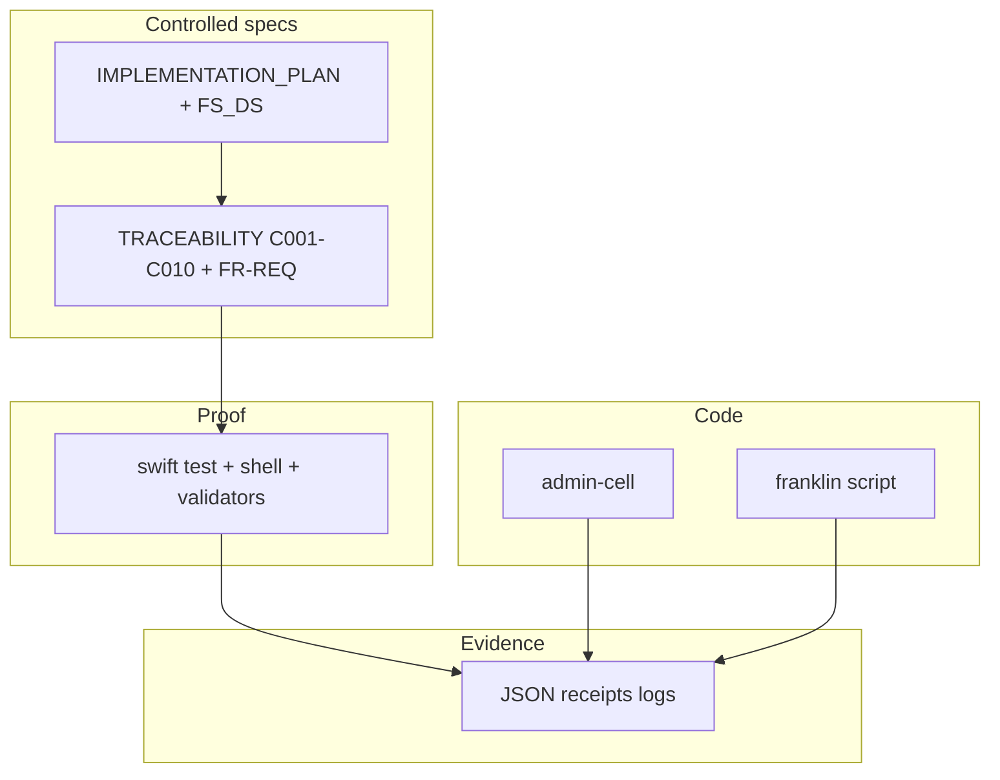

# Franklin implementation plan + documentation tied to the app (GAMP)

**In-repo copy** for review (lives next to [IMPLEMENTATION_PLAN.md](./IMPLEMENTATION_PLAN.md)). Cursor’s Plans UI may still reference a file under `~/.cursor/plans/`; this path is the **git-visible** one on GitHub `main`.

**If you only opened the `GAIAOS` subfolder in the IDE** you will not see `cells/` in the tree. The git root is the **parent** of `GAIAOS` (see [GAIAOS/WORKSPACE_GIT_ROOT.md](../../GAIAOS/WORKSPACE_GIT_ROOT.md)). A **stub** link for GAIAOS-rooted workspaces: [GAIAOS/docs/PLAN_DocApp_GAMP_Traceability.md](../../GAIAOS/docs/PLAN_DocApp_GAMP_Traceability.md).

## Canonical in-repo spec

[IMPLEMENTATION_PLAN.md](./IMPLEMENTATION_PLAN.md) is the **v1.0** Franklin Cell **Complete Implementation and Qualification Plan** (URS, FS, DS, VMP-style summary, traceability structure, and phased F0–F8 schedule, including receipt envelope v2, suppliers, and ALCOA+ mapping) — *draft* per its frontmatter **until** Mother countersigns where the plan requires. It is the **master product and qualification narrative** for the **Mac admin cell** and shared vQbit plane on one Mac.

This file, [PLAN_DocApp_GAMP_Traceability.md](./PLAN_DocApp_GAMP_Traceability.md), is the **companion** for **GAMP doc↔app traceability** and **per-phase exit criteria** (“stated / verified / evidenced”), Part 11 posture, and RTM discipline. It does **not** compete with the master spec; it defines **how** requirements in the master spec are mechanically closed with tests and evidence.

**Work completed against this file’s own checklist (in-repo, not a paper claim):** [TRACEABILITY.md](./TRACEABILITY.md) (C-001…C-010 + `FR-REQ-###` for what actually ships), [SUPPLIERS.md](./SUPPLIERS.md), [scripts/franklin_gamp5_validate.sh](./scripts/franklin_gamp5_validate.sh) (orchestrates `swift test` + receipt conformance), [VERSION](./VERSION) / [pins.json](./pins.json) scaffolds, and additive entries in [docs/audit/calibrated-language-gamp-audit-v2/test_gate_map.v1.yaml](../../docs/audit/calibrated-language-gamp-audit-v2/test_gate_map.v1.yaml) — all tracked in the YAML `todos` block above.

## Framing (from product plan — Mac cell + shared vQbit)

- Franklin is a **Mac admin mesh cell** (Father substrate) with **unified vQbit** with domain cells on the host; the **global** nine-cell Klein-bottle **network** graph is unchanged; **one Franklin per Mac** is expected; Mother/web Docker remains out of the current Mac development track in the spec’s boundary language.
- **Honors** C-001…C-010; **does not** violate 76-byte `vQbitPrimitive` ABI, **&lt;3ms** Metal budget, or **forge τ**.
- **Foundation today (load-bearing, preserve):** `admin-cell` (`Process` + `/bin/zsh`), [franklin_mac_admin_gamp5_zero_human.sh](../health/scripts/franklin_mac_admin_gamp5_zero_human.sh), `franklin_mac_admin_gamp5_receipt_v1` → `cells/health/evidence/`, `GAIAOS/mac_cell/FranklinGAMP5Admin/`, `health_full_local_iqoqpq_gamp.sh`, Console → `admin-cell`, [LOCKED.md](../fusion/macos/GaiaFTCLConsole/LOCKED.md).

## GAMP rule: documentation is never sufficient alone

| Layer | “Happened” means |
|-------|------------------|
| **Stated** | Requirement ID in controlled doc (FS/DS/PLAN) — GAMP: *if it is not documented, you did not do it* |
| **Verified** | Named automated test, manual OQ step, or instrumented run with pass/fail |
| **Evidenced** | Immutable artifact: JSON receipt, test log, signed output, with ALCOA+ fields where the QMS requires |

**21 CFR Part 11:** this repo’s posture is **electronic records, audit trail, validation** — not “100% line coverage of every file.” Use **100% of *stated* requirements in the RTM** with passing tests/receipts, matching the health orchestrator’s **“mechanical 100%”** closure concept ([LOCAL_IQOQPQ_ORCHESTRATOR_V3.1_EXECUTION_PLAN.md](../health/docs/LOCAL_IQOQPQ_ORCHESTRATOR_V3.1_EXECUTION_PLAN.md)).

**Trust root (no circular self-attestation):** domain cell ← **Father** ← **Mother** ← **mesh** consensus (from product plan). RTM and receipts must make that order explicit in evidence, not only in prose.

## Architecture layers (target) vs evidence

Each layer in the product plan (substrate, identity, clock, vQbit, heal library, inventory, Mother protocol, receipt v2, CLI) is **[target]** until code + tests + receipts exist. **No layer may be marked “implemented” in RTM** without: **(1)** design reference, **(2)** test or script proof, **(3)** evidence path or receipt schema field.

## Phased build — each phase: build intent + GAMP exit (merged)

| Phase | Build (summary) | GAMP / traceability exit (before claiming “done”) |
|-------|------------------|-----------------------------------------------------|
| **F0** | Harden: sign/notarize, env, ancestry, hash pin; v1 + attribution fields | **RTM** rows for each F0 req; **tests** parse emitted JSON (user/host/toolchain/runner hash, timestamps); **receipt** from zero-human run attributable; optional **Developer ID** SOP ref |
| **F1** | Father wallet bootstrap; **τ** polling; sign receipts | `franklin_bootstrap_receipt.json` + **offline** pubkey verify test; **τ** never forged — tests for `authoritative_offline` / no silent fake τ |
| **F2** | Cell inventory + vQbit; `admin-cell snapshot` | Snapshot JSON **schema test**; inventory transitions wired to real orchestrator receipts in RTM |
| **F3** | Heal library; 3–5 actions; `pending_mother_reauthorization` | Each action: **OQ** script + planted-fault test; quarantine = inside manifold (assert in test) |
| **F4** | Franklin self IQ/OQ/PQ | `evidence/franklin_self_qualification_*.json`; **RTM** maps **each C-001…C-010** to Franklin behavior *or* explicit N/A with rationale |
| **F5** | Mother protocol; NATS; v2 countersign | **Gated** on Mother governance; RTM + **live** countersigned receipt; orphan-mode tests |
| **F6** | Handoff / fostering | End-to-end **two-Father** chain test + teardown receipt |
| **F7** | TestRobot code retirement | Build graph has no live `TestRobot` artifact; **migration receipt**; Console label “Franklin (live)” — **e2e** or build assert |
| **F8** | Multi-domain registry (optional) | RTM for cell-kind extensibility; tests for registry only if shipped |

**Rollout:** If Mother slips **past F2**, read-only observer is **named** in schedule; RTM marks Mother-dependent rows **deferred** — not “green.”

**Open decisions** (Mother governance, heal scope, Father count, signing identity, **τ** source) **gate** the rows above: until decided, F5/F1 **τ** supplier-assessment rows stay **[I]** or `TBD` in VMP, not `PASS`.

## Qualification strategy (from product plan — tied to artifacts)

- **GAMP 4/5** (configured automation): **VMP** (Franklin in scope), **FS** (refined from [IMPLEMENTATION_PLAN.md](./IMPLEMENTATION_PLAN.md)), **DS** per component, **IQ/OQ/PQ** in **F4**, **RTM** C-001…C-010 → behavior, **CC SOP** for heal library.
- **Franklin does not judge domain cells** until Franklin’s self-qual is **green** and **countersigned** (when Mother exists) — this becomes **explicit** RTM gating rows, not a slogan.

## Risks (product plan) — GAMP mitigations in execution

- **v1 → v2 churn:** never mutate stored v1; dual-emit; **RTM** version column.
- **τ** flakiness: `authoritative_offline` + queue for τ-stamp; **test** that script never forges τ.
- **IP drift (vQbit, Metal):** **IP-sensitive** review gate on merge; link RTM to [vqbit-surface.md](../../docs/concepts/vqbit-surface.md).
- **Klein bottle / quarantine:** quarantine **inside** manifold — **OQ** asserts inventory + REFUSED-class semantics.
- **F3 local heals vs F5 Mother:** `pending_mother_reauthorization`; F5 re-sign test.

## Reuse: existing doc↔app infrastructure

- [health_cell_gamp5_validate.sh](../health/scripts/health_cell_gamp5_validate.sh) — pattern for “one script = doc + test proof.”
- [test_gate_map.v1.yaml](../../docs/audit/calibrated-language-gamp-audit-v2/test_gate_map.v1.yaml) — extend **additively** for Franklin.
- [AdminCellRunner README](../health/swift/AdminCellRunner/README.md) — SUV vs tool boundary.
- Franklin **today:** [test_franklin_receipt_conformance.sh](./tests/test_franklin_receipt_conformance.sh), [fo-franklin `validate-receipt-v1`](../shared/rust/fo_cell_substrate) (build: `cargo build -p fo_cell_substrate --release`).

## Implementation deliverables (this effort)

| Deliverable | Purpose |
|-------------|---------|
| [IMPLEMENTATION_PLAN.md](./IMPLEMENTATION_PLAN.md) (edit) | Per-phase **GAMP exit** column or subsection; **Implemented** vs **[target]** |
| `TRACEABILITY.md` | FR-REQ and C-001…C-010 → doc → test → evidence |
| `scripts/franklin_gamp5_validate.sh` | One command: `swift test` + receipt conformance (+ optional E2E) |
| `test_gate_map.v1.yaml` (additive) | Franklin gates + `spec_ref` |
| `README` + optional CI | Document “prove Franklin” command |

## Order of work

1. **Edit `IMPLEMENTATION_PLAN.md`** — add **GAMP exit** (tests + evidence + RTM) per F0–F8 row; mark Foundation vs target.
2. **Inventory** implemented requirements (v1, admin-cell, script) → FR-REQ-ids.
3. **Author `TRACEABILITY.md`** — include **C-001…C-010** subsection (F4 completes enforcement evidence).
4. **Add `franklin_gamp5_validate.sh`**
5. **Extend `test_gate_map` + CI or operator runbook**
6. **Part 11 / e-record boundary** — where Franklin is still *dev tool*, align wording with [LOCAL_IQOQPQ_ORCHESTRATOR_V3.md](../health/docs/LOCAL_IQOQPQ_ORCHESTRATOR_V3.md) §11

## Risk (execution)

- **False victory:** marking phases or Part 11 “complete” without VMP, keys, and e-sign SOPs — keep RTM and IMPLEMENTATION_PLAN **honest** on posture.
