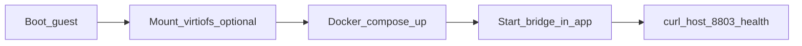

# Fusion sovereign sidecar — field of fields (parallel limbs + closure sequence)

**Active plan (packaging + deploy runbook):** [`FUSION_SIDECAR_ACTIVE_PLAN.md`](FUSION_SIDECAR_ACTIVE_PLAN.md)

**Purpose:** What can run **in parallel** in the repo vs the **ordered steps** to close the live VM + bridge. No false victory: green only after the witness commands succeed.

---

## Manifold axes

| Axis | Closed when | Witness |
|------|-------------|---------|
| **S4 projection** | Next + `/api/fusion/s4-projection` unchanged; `MCP_BASE_URL` → **8803** | Playwright / manual UI |
| **C4 cell (guest)** | `docker-compose.fusion-sidecar.yml` up in Linux VM | `curl guest:8803/health` |
| **Host bridge** | FusionSidecarHost **Start bridge** | `curl 127.0.0.1:8803/health` |
| **Virtiofs GAIA** | Optional host folder → tag `gaiaos` | `ls /opt/gaiaos/docker-compose.fusion-sidecar.yml` in guest |

---

## Parallel limbs (no dependency order for *repo* work)

| Limb | Task | Status |
|------|------|--------|
| **L1** | `docker-compose.fusion-sidecar.yml` + `docker compose config` | Run `scripts/verify_fusion_sidecar_bundle.sh` |
| **L2** | Guest pack `deploy/mac_cell_mount/fusion_sidecar_guest/` | Review + bake into golden image |
| **L3** | `macos/FusionSidecarHost` Xcode build | `xcodebuild -scheme FusionSidecarHost …` |
| **L4** | Docs + mental snapshot | Linked from `MENTAL_SNAPSHOT_MAC_FUSION_MESH_CELL.md` |

L1–L4 can advance **simultaneously** on different machines or CI jobs.

---

## Serial dependency (runtime)



---

## Remaining closure (operator sequence)

| Step | Do this |
|------|---------|
| **FusionSidecarHost.app on each Mac cell** | Build in local Xcode (or CI); zip/rsync **`FusionSidecarHost.app`** to cells; first open via **right-click → Open** if Gatekeeper prompts (no App Store). |
| **Golden guest `.raw` + vmlinuz + initrd** | Build or copy ARM64 Ubuntu-style cloud assets; point the app at those three paths. |
| **Guest NIC name** | If static IP fails, fix interface name in **`fusion_sidecar_guest/network-config-static.yaml`** (`enp0s1` → match `ip link` in guest). |
| **Docker in guest** | Install once in the guest image (`get.docker.com` or `docker.io` package). |
| **End-to-end** | Guest: `docker compose -f docker-compose.fusion-sidecar.yml up -d` → App: **Start bridge** → host: `curl -sS http://127.0.0.1:8803/health` |

---

## Single receipt command (artifact bundle only)

```bash
bash cells/fusion/scripts/verify_fusion_sidecar_bundle.sh
```

End-to-end VM + bridge receipt remains **operator + hardware**, not this file alone.

*Norwich / GaiaFTCL — reduce torsion with explicit axes.*
