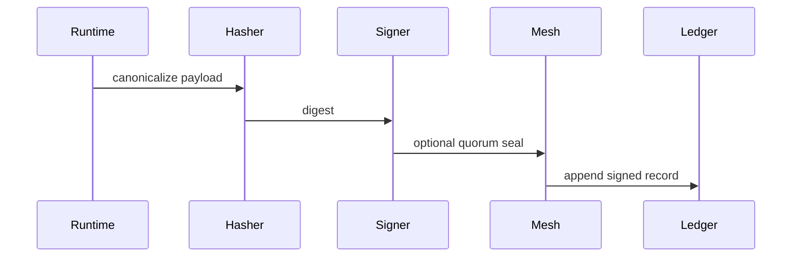

# AUDIT_EVENT_ROUTING — OWL-NUTRITION

**Companion:** [`AUDIT_FRAMEWORK.md`](AUDIT_FRAMEWORK.md)

## 1. Event shape

Every audit event: `timestamp_utc_ns`, `actor_wallet`, `event_class`, `payload_hash`, `invariants_touched[]`, `outcome`, `epistemic_tag`, `schema_versions`, `c4_filter_versions`, `mesh_cell_id`, `signature`.

Append-only ledger; tamper check on render.

## 2. Sequence (normative)

## 3. Signer model

- **Primary:** Operator **Owl / wallet-bound** identity mooring — aligns Part 11 narrative **[I]** implementation detail in MacHealth.

## 4. Quorum

- **Projection receipts:** mesh **5-of-9 [I]** — same as program-wide policy when implemented.  
- **Audit events:** **lighter path** — **local sign-then-replicate** to ledger with **eventual mesh consistency** **[I]** engineering ticket `AUDIT-QUORUM-001`.

## 5. Partition / offline

- Queue events locally with **monotonic seq**; **REFUSED** seal if partition exceeds policy TTL **[I]** `AUDIT-PART-001`.

## 6. Code

Implementation in `cells/health/**` with tests **[I]** — Phase 6 delivery tracked in `evidence/oq/`.
