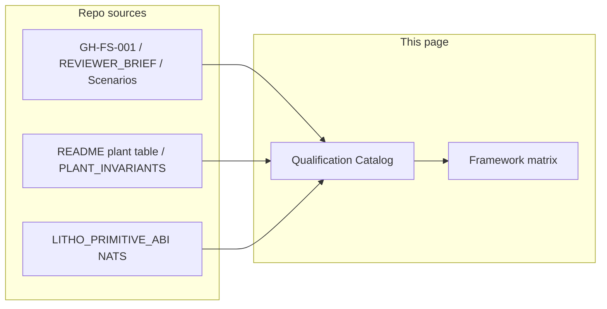

## Mac GAMP5 external-loop (owner-Mac signoff)

External-loop reference implementation and game mapping:

- `zsh cells/franklin/scripts/mac_gamp5_external_loop.sh`
- `zsh cells/franklin/scripts/mac_gamp5_signoff_pack.sh`
- `cells/franklin/docs/MAC_GAMP5_EXTERNAL_LOOP_GAMES.md`

Required gates in the loop:

1. `cells/franklin/tests/test_mac_mesh_cell_narrative_lock.sh`
2. `cells/health/scripts/health_cell_gamp5_validate.sh --skip-cargo-test`
3. `cells/health/scripts/franklin_mac_admin_gamp5_zero_human.sh` (`FRANKLIN_GAMP5_SMOKE=1`)

Required evidence families:

- `cells/health/evidence/mac_gamp5_external_loop/**`
- `cells/health/evidence/macfranklin_state/state_*.json`
- `cells/health/evidence/franklin_mac_admin_gamp5_*.json`

MCP observer tools for outside-in game checks (state + screenshot + expected/actual + receipt):
`franklin_capture_screenshot`, `franklin_runtime_state_latest`, `franklin_visual_validate`, `franklin_publish_game_receipt`.
# Qualification Catalog

## Enumerated gates, plants, and silicon events — with framework mapping

**FortressAI Research Institute | Norwich, Connecticut**  
**Patents: USPTO 19/460,960 | USPTO 19/096,071 — © 2026 Richard Gillespie**

> **Thesis.** This page does not argue in prose what the substrate “does.” It **names** what is specified on `main` — functional requirements, plant surfaces, CURE gates, SIL scenario IDs, LithoPrimitive event classes, and NATS families — and maps them to qualification posture **honestly** (including explicit **N/A** where a framework is out of scope).

> **GAMP 5 — automated catalog verification (local).** From the repository root: `zsh cells/health/scripts/health_cell_gamp5_validate.sh` — runs wiki link lint (this directory’s top-level `*.md`), asserts §8 / OWL-NUTRITION / OWL-MITO / peptide LIGAND-CLASS / GAMP markers in this file, checks that every `github.com/gaiaftcl-sudo/gaiaFTCL/blob/main/...` link resolves to a file on disk, runs **`owl_mito_docs_gate.sh`** (no legacy citation placeholders under `OWL-MITO/`), OWL-NUTRITION IQ/OQ/PQ (`owl_nutrition_iqoqpq_validate.sh`), **LIGAND-CLASS / peptide** IQ + targeted OQ + JSON receipt (`peptide_ligand_class_gamp5_evidence.sh`), then `cargo test --workspace` under `cells/health/`. This is **documentation + test traceability**, not a substitute for a sponsor QMS sign-off.

> **Calibrated language-game + GAMP audit (v2).** Procedure pack (manifest scripts, risk / ALCOA+ / gap registers, review gates, **[test↔gate map](https://github.com/gaiaftcl-sudo/gaiaFTCL/blob/main/docs/audit/calibrated-language-gamp-audit-v2/test_gate_map.v1.yaml)**): [`docs/audit/calibrated-language-gamp-audit-v2/README.md`](https://github.com/gaiaftcl-sudo/gaiaFTCL/blob/main/docs/audit/calibrated-language-gamp-audit-v2/README.md) — index at [`docs/audit/README.md`](https://github.com/gaiaftcl-sudo/gaiaFTCL/blob/main/docs/audit/README.md). **Local-only helpers (not a substitute for external evidence storage):** `bash docs/audit/calibrated-language-gamp-audit-v2/scripts/record_baseline.sh`, `bash docs/audit/calibrated-language-gamp-audit-v2/scripts/generate_manifest.sh`; Rust names in the map must match `cargo test -p gaia-health-substrate -- --list`. Evidence layout: [PHASE-3-EVIDENCE-STORAGE.md](https://github.com/gaiaftcl-sudo/gaiaFTCL/blob/main/docs/audit/calibrated-language-gamp-audit-v2/PHASE-3-EVIDENCE-STORAGE.md).

---

## Table of contents

1. [What this catalog is](#1-what-this-catalog-is)
2. [Authoritative sources](#2-authoritative-sources)
3. [Methodology note (Cardilini et al.)](#3-methodology-note-cardilini-et-al)
4. [GaiaHealth — requirements & scenarios](#4-gaiahealth--requirements--scenarios)
5. [GaiaFusion — nine plant kinds](#5-gaiafusion--nine-plant-kinds)
6. [GaiaLithography — event classes & NATS](#6-gaialithography--event-classes--nats)
7. [Source → catalog flow](#7-source--catalog-flow)
8. [Framework applicability matrix](#8-framework-applicability-matrix)
9. [Bounded pluralism](#9-bounded-pluralism)
10. [See also](#10-see-also)

Subsections: [§4.4 OWL-P53-INV1](#44-owl-p53-inv1--oncology-invariant-package-tumor-suppression) · [§4.5 OWL-NUTRITION](#45-owl-nutrition--nutrition-invariant-family) · [§4.6 LIGAND-CLASS / peptide](#46-ligand-class--peptide-therapy-integration) · [§4.7 OWL-MITO](#47-owl-mito--mitochondrial-pearling-candidate-package) · [§8.1 OWL-P53 targets + ISO 9001](#81-owl-p53-inv1-v1--framework-targets--footnotes--iso-9001) · [§8.3 Peptide framework targets](#83-peptide-ligand-class--framework-targets) · [§8.4 OWL-MITO targets](#84-owl-mito-v1--framework-targets)

---

## 1. What this catalog is

A structured catalog of **qualified inference and substrate actions** implemented or specified across three product cells:

| Cell | Role in this page |
|------|-------------------|
| **GaiaHealth** | FR-001…FR-004, C-1…C-7, **nine** SIL scenario IDs (separate from CURE), communion UI as **[I]/roadmap** where tagged in-repo |
| **GaiaFusion** | Nine canonical plant kinds + telemetry columns; constitutional C-001…C-010 on the mesh (README) |
| **GaiaLithography** | LithoPrimitive **event_class** values + NATS subject families; GAMP/CCR/deviation subjects per GAMP5 lifecycle |

Each row below ties to:

- a **constitutional or functional gate** (where defined on `main`),
- **M / I / A / T** epistemic classes where applicable,
- **receipt types** (IQ/OQ/PQ, WASM, Swift/Rust tests, LithoPrimitive, GAMP records),
- and the **framework applicability** in [§8](#8-framework-applicability-matrix).

---

## 2. Authoritative sources

All enumeration is drawn from these documents only (no invented sensor lists or domains):

- **[GH-FS-001 — Functional Specification](https://github.com/gaiaftcl-sudo/gaiaFTCL/blob/main/cells/health/docs/FUNCTIONAL_SPECIFICATION.md)** — FR-001…FR-004+; §4 non-functional; §5 functional requirements → test mapping  
- **[REVIEWER_BRIEF — C-1…C-7](https://github.com/gaiaftcl-sudo/gaiaFTCL/blob/main/cells/health/docs/REVIEWER_BRIEF.md)** — traceability to WASM / Rust / Swift  
- **[Scenarios_Physics_Frequencies_Assertions.md](https://github.com/gaiaftcl-sudo/gaiaFTCL/blob/main/Scenarios_Physics_Frequencies_Assertions.md)** — nine SIL scenario contracts (seven interventional + two observational imaging)  
- **[REGISTRY_TIERS.md](https://github.com/gaiaftcl-sudo/gaiaFTCL/blob/main/cells/health/docs/invariants/REGISTRY_TIERS.md)** — candidate / mother / retired vocabulary  
- **[README — nine plant kinds](https://github.com/gaiaftcl-sudo/gaiaFTCL/blob/main/README.md)** — plant table + constitutional constraints section  
- **[PLANT_INVARIANTS.md](https://github.com/gaiaftcl-sudo/gaiaFTCL/blob/main/cells/fusion/macos/GaiaFusion/docs/PLANT_INVARIANTS.md)** — invariant-level bounds (optional deeper read)  
- **[LITHO_PRIMITIVE_ABI.md](https://github.com/gaiaftcl-sudo/gaiaFTCL/blob/main/cells/lithography/docs/LITHO_PRIMITIVE_ABI.md)** — §2 event classes; §5 NATS taxonomy  
- **[GAMP5_LIFECYCLE.md](https://github.com/gaiaftcl-sudo/gaiaFTCL/blob/main/cells/lithography/docs/GAMP5_LIFECYCLE.md)** — CCR, deviation, fab closeout, Franklin wildcard  
- **[S4_C4_COMMUNION_UI_SPEC.md](https://github.com/gaiaftcl-sudo/gaiaFTCL/blob/main/cells/health/docs/S4_C4_COMMUNION_UI_SPEC.md)** — design-target communion (**[I]**); does not extend GH-FS-001 without change control  
- **[OWL-P53-INV1 — INVARIANT_SPEC](https://github.com/gaiaftcl-sudo/gaiaFTCL/blob/main/cells/health/docs/invariants/OWL-P53/INVARIANT_SPEC.md)** — oncology composite invariant documentation package (v1 **ordinary** invariant; nested IQ/OQ/PQ on `main`; **mother** topology deferred per CCR decision)
- **[PEPTIDE_INTEGRATION_SPEC — HEALTH-PEPTIDE-SPEC-V1](https://github.com/gaiaftcl-sudo/gaiaFTCL/blob/main/cells/health/docs/PEPTIDE_INTEGRATION_SPEC.md)** — peptide as **ligand class** inside MD/WASM; INV-HEALTH-LC-01..06; CCR **CCR-HEALTH-PEPTIDE-V1** gates `main` per Phase 0 exit criterion
- **[Calibrated language-game + GAMP audit (v2)](https://github.com/gaiaftcl-sudo/gaiaFTCL/blob/main/docs/audit/calibrated-language-gamp-audit-v2/README.md)** — templates, `test_gate_map.v1.yaml`, manifest/baseline scripts; pin `baseline_sha` at execution
- **LOCAL_IQOQPQ_ORCHESTRATOR v3.1** — one-machine IQ/OQ/PQ automation spec: [`cells/health/docs/LOCAL_IQOQPQ_ORCHESTRATOR_V3.md`](https://github.com/gaiaftcl-sudo/gaiaFTCL/blob/main/cells/health/docs/LOCAL_IQOQPQ_ORCHESTRATOR_V3.md) — run `bash cells/health/scripts/health_full_local_iqoqpq_gamp.sh`. **Register precedence (v3.1):** the calibrated audit v2 register wins governance/compliance disagreements; v3.1 run receipts win execution-fact; substantive conflicts → v3.x spec patch.

---

## 3. Methodology note (Cardilini et al.)

Structured after the Delphi-style catalog described in **Cardilini et al.** (*Biological Conservation*, vol. **313**, article **111593**, **2026**) — *Compassionate conservation practice: supporting diverse conservation actions but context matters* — where contested “do nothing” framings were countered by **enumerating discrete actions** with expert evaluation.

| Field | Value |
|-------|--------|
| Journal | *Biological Conservation* (Elsevier) |
| Volume / article | 313 / 111593 |
| Year | 2026 |
| **DOI** | [10.1016/j.biocon.2025.111593](https://doi.org/10.1016/j.biocon.2025.111593) |

This catalog applies the same **structural move** to **qualified inference substrate**: name what is on `main`, link receipts, and separate **design-target** communion (extended specs, **[I]**) from **shipped** tests and FRs.

---

## 4. GaiaHealth — requirements & scenarios

Per [GH-FS-001](https://github.com/gaiaftcl-sudo/gaiaFTCL/blob/main/cells/health/docs/FUNCTIONAL_SPECIFICATION.md):

### 4.1 Functional requirements (summary rows)

| ID | Action / capability | Gate / ID | Epistemic / receipt | Source |
|----|---------------------|-----------|---------------------|--------|
| GH-SM | **11-state lifecycle** (IDLE…AUDIT_HOLD) | FR-001 | State + transition logs; TestRobit | FR-001 table |
| GH-TR | **Approved transition enforcement** | FR-002 | `OwlError::InvalidTransition` on bad edges | FR-002 matrix |
| GH-EP | **M/I/A classification** on outputs | FR-003 | Metal pipeline alpha; shader enforcement | FR-003 |
| GH-C1…C7 | **CURE emission gates** | FR-004 C-1…C-7 | WASM + Rust/Swift tests per [REVIEWER_BRIEF](https://github.com/gaiaftcl-sudo/gaiaFTCL/blob/main/cells/health/docs/REVIEWER_BRIEF.md) | FR-004 + REVIEWER_BRIEF |

### 4.2 SIL V2 scenario contracts (nine IDs — not C-1…C-7)

**Interventional (seven):** `inv3_aml` · `parkinsons_synuclein_thz` · `msl_tnbc` · `breast_cancer_general_thz` · `colon_cancer_thz` · `lung_cancer_thz_thermal` · `skin_cancer_bcc_melanoma`  
**Observational imaging (two, §0-OBS / §10-OBS):** `parkinsons_mito_pearling_obs` · `mitochondria_cristae_network_obs`

Sources: [Scenarios_Physics_Frequencies_Assertions.md](https://github.com/gaiaftcl-sudo/gaiaFTCL/blob/main/Scenarios_Physics_Frequencies_Assertions.md); Swift `ClinicalScenario` in [REVIEWER_BRIEF](https://github.com/gaiaftcl-sudo/gaiaFTCL/blob/main/cells/health/docs/REVIEWER_BRIEF.md); OWL-MITO package [`OWL-MITO/README.md`](https://github.com/gaiaftcl-sudo/gaiaFTCL/blob/main/cells/health/docs/invariants/OWL-MITO/README.md).

### 4.3 S4↔C4 Communion UI

Multi-modal ingest, projection workbench, epistemic ledger: **design target** — [S4_C4_COMMUNION_UI_SPEC.md](https://github.com/gaiaftcl-sudo/gaiaFTCL/blob/main/cells/health/docs/S4_C4_COMMUNION_UI_SPEC.md). Does not expand GH-FS-001 until change control ([GH-FS-001 §1](https://github.com/gaiaftcl-sudo/gaiaFTCL/blob/main/cells/health/docs/FUNCTIONAL_SPECIFICATION.md)).

### 4.4 OWL-P53-INV1 — Oncology invariant package (tumor suppression)

Documentation package on `main` under `cells/health/docs/invariants/OWL-P53/`. **v1** registers an **ordinary** C4-aligned invariant; **mother-invariant** projection against other invariants is **v2** + three-cell architectural CCR (see `MOTHER_INVARIANT_CCR_DECISION.md` in the same directory).

| Field | Value |
|-------|--------|
| **Invariant ID** | `OWL-P53-INV1-TUMOR-SUPPRESSION` |
| **Core spec** | [INVARIANT_SPEC.md (blob)](https://github.com/gaiaftcl-sudo/gaiaFTCL/blob/main/cells/health/docs/invariants/OWL-P53/INVARIANT_SPEC.md) |
| **Package index** | [README.md (blob)](https://github.com/gaiaftcl-sudo/gaiaFTCL/blob/main/cells/health/docs/invariants/OWL-P53/README.md) |
| **IQ / OQ / PQ** | [IQ](https://github.com/gaiaftcl-sudo/gaiaFTCL/blob/main/cells/health/docs/invariants/OWL-P53/IQ_PROTOCOL.md) · [OQ](https://github.com/gaiaftcl-sudo/gaiaFTCL/blob/main/cells/health/docs/invariants/OWL-P53/OQ_PROTOCOL.md) · [PQ](https://github.com/gaiaftcl-sudo/gaiaFTCL/blob/main/cells/health/docs/invariants/OWL-P53/PQ_PROTOCOL.md) |
| **PQ split** | **PQ-v1** = synthetic / dry-run / DUA-safe horizon. **PQ-v2** = IRB / **human** biobank cohorts only (germline *TP53* / LFS-class, matched controls, somatic p53-pathway oncology) — **separate** milestone; see [PQ_PROTOCOL.md (blob)](https://github.com/gaiaftcl-sudo/gaiaFTCL/blob/main/cells/health/docs/invariants/OWL-P53/PQ_PROTOCOL.md). |
| **PQ-v2 substrate** | **Humans only** — no non-human biological material for this invariant’s PQ-v2; evolutionary literature is background in [INVARIANT_SPEC.md (blob)](https://github.com/gaiaftcl-sudo/gaiaFTCL/blob/main/cells/health/docs/invariants/OWL-P53/INVARIANT_SPEC.md) §1, not a cohort arm. |

Framework targets with footnotes (including **ISO 9001**): [§8.1](#81-owl-p53-inv1-v1--framework-targets--footnotes--iso-9001).

### 4.5 OWL-NUTRITION — Nutrition invariant family

Documentation on `main` under `cells/health/docs/invariants/OWL-NUTRITION/` — **12 mother invariants**, **3** example sub-invariants (rolling CAB cadence per family spec), JSON schemas, WASM nutrition exports (`wasm_constitutional` `nutrition` module), MacHealth Swift **viewport** stubs (`MacHealth/Views/Nutrition/`). **CAB** constitution required before PQ human numeric closure.

| Field | Value |
|-------|--------|
| **Family ID** | `GH-OWL-NUTRITION-FAM-001` |
| **Family spec** | [INVARIANT_FAMILY_SPEC.md (blob)](https://github.com/gaiaftcl-sudo/gaiaFTCL/blob/main/cells/health/docs/invariants/OWL-NUTRITION/INVARIANT_FAMILY_SPEC.md) |
| **README** | [README.md (blob)](https://github.com/gaiaftcl-sudo/gaiaFTCL/blob/main/cells/health/docs/invariants/OWL-NUTRITION/README.md) |
| **IQ / OQ / PQ** | [IQ](https://github.com/gaiaftcl-sudo/gaiaFTCL/blob/main/cells/health/docs/invariants/OWL-NUTRITION/IQ_PROTOCOL.md) · [OQ](https://github.com/gaiaftcl-sudo/gaiaFTCL/blob/main/cells/health/docs/invariants/OWL-NUTRITION/OQ_PROTOCOL.md) · [PQ](https://github.com/gaiaftcl-sudo/gaiaFTCL/blob/main/cells/health/docs/invariants/OWL-NUTRITION/PQ_PROTOCOL.md) |
| **CAB** | [CAB_CONSTITUTION.md (blob)](https://github.com/gaiaftcl-sudo/gaiaFTCL/blob/main/cells/health/docs/invariants/OWL-NUTRITION/CAB_CONSTITUTION.md) |
| **Communion UI** | [NUTRITION_UI_SPEC.md (blob)](https://github.com/gaiaftcl-sudo/gaiaFTCL/blob/main/cells/health/docs/invariants/OWL-NUTRITION/NUTRITION_UI_SPEC.md) — GaiaHealth-internal until CCR merges into Communion spec ([decision](https://github.com/gaiaftcl-sudo/gaiaFTCL/blob/main/docs/state/NUTRITION_COMMUNION_ARCH_DECISION.md)). |
| **Framework row** | [§8.2](#82-owl-nutrition-v1--framework-targets) |

### 4.6 LIGAND-CLASS — Peptide therapy integration

Documentation on `main` under `cells/health/docs/` and `cells/health/docs/invariants/LIGAND-CLASS/` — **peptide ligand class** inside the existing Biologit MD pipeline (not a parallel kinematic track). **BioligitPrimitive** ABI v1.1: `ligand_class` byte at offset **88** (96-byte struct preserved). WASM class-aware ADMET/selectivity/FF gates; PGx hashed features with separate consent scope ([PGX_POLICY.md](https://github.com/gaiaftcl-sudo/gaiaFTCL/blob/main/cells/health/docs/invariants/LIGAND-CLASS/PGX_POLICY.md)).

| Field | Value |
|-------|--------|
| **Spec ID** | `HEALTH-PEPTIDE-SPEC-V1` |
| **Integration spec** | [PEPTIDE_INTEGRATION_SPEC.md (blob)](https://github.com/gaiaftcl-sudo/gaiaFTCL/blob/main/cells/health/docs/PEPTIDE_INTEGRATION_SPEC.md) |
| **Change control** | [CCR-HEALTH-PEPTIDE-V1.md (blob)](https://github.com/gaiaftcl-sudo/gaiaFTCL/blob/main/cells/health/docs/ccr/CCR-HEALTH-PEPTIDE-V1.md) — three-of-three Lithography + Fusion + Health signatures **[I]** until signed |
| **Invariants** | [LIGAND-CLASS/README.md (blob)](https://github.com/gaiaftcl-sudo/gaiaFTCL/blob/main/cells/health/docs/invariants/LIGAND-CLASS/README.md) — INV-HEALTH-LC-01..06 |
| **IQ / OQ / PQ** | [OQ_PEPTIDE_V1.md (blob)](https://github.com/gaiaftcl-sudo/gaiaFTCL/blob/main/cells/health/docs/qualification/OQ_PEPTIDE_V1.md) · [PQ_PEPTIDE_V1.md (blob)](https://github.com/gaiaftcl-sudo/gaiaFTCL/blob/main/cells/health/docs/qualification/PQ_PEPTIDE_V1.md) |
| **Automated evidence** | `zsh cells/health/scripts/peptide_ligand_class_gamp5_evidence.sh` → `cells/health/docs/invariants/LIGAND-CLASS/evidence/peptide_ligand_class_gamp5_receipt.json` |
| **Communion UI** | [S4_C4_COMMUNION_UI_SPEC.md §5.3](https://github.com/gaiaftcl-sudo/gaiaFTCL/blob/main/cells/health/docs/S4_C4_COMMUNION_UI_SPEC.md) — MOL/PEP ligand-class badge (**[I]** until UI ships) |
| **Framework row** | [§8.3](#83-peptide-ligand-class--framework-targets) |

### 4.7 OWL-MITO — mitochondrial pearling (candidate package)

Documentation on `main` under `cells/health/docs/invariants/OWL-MITO/` — **Landoni-aligned** observational imaging constructs (pearling morphodynamics, nucleoid spacing, cristae / MICOS) with **candidate** tier per [`REGISTRY_TIERS.md`](https://github.com/gaiaftcl-sudo/gaiaFTCL/blob/main/cells/health/docs/invariants/REGISTRY_TIERS.md). **Two** new `ClinicalScenario` IDs use **§0-OBS** rails and **parallel §10-OBS** receipts (not interventional §10).

| Field | Value |
|-------|--------|
| **Working family ID** | `OWL-MITO-MORPHODYNAMICS-001` |
| **Package index** | [README.md (blob)](https://github.com/gaiaftcl-sudo/gaiaFTCL/blob/main/cells/health/docs/invariants/OWL-MITO/README.md) |
| **Scenario class spec** | [SCENARIO_CLASS_SPEC.md (blob)](https://github.com/gaiaftcl-sudo/gaiaFTCL/blob/main/cells/health/docs/invariants/OWL-MITO/SCENARIO_CLASS_SPEC.md) |
| **Citation gate** | [PHASE0_VERIFICATION.md (blob)](https://github.com/gaiaftcl-sudo/gaiaFTCL/blob/main/cells/health/docs/invariants/OWL-MITO/PHASE0_VERIFICATION.md) |
| **CCR (invariant doc)** | [CCR-HEALTH-MITO-INVARIANT-V1.md (blob)](https://github.com/gaiaftcl-sudo/gaiaFTCL/blob/main/cells/health/docs/ccr/CCR-HEALTH-MITO-INVARIANT-V1.md) |
| **CCR (scenarios + §10-OBS)** | [CCR-HEALTH-MITO-SCENARIOS-V1.md (blob)](https://github.com/gaiaftcl-sudo/gaiaFTCL/blob/main/cells/health/docs/ccr/CCR-HEALTH-MITO-SCENARIOS-V1.md) |
| **Framework row** | [§8.4](#84-owl-mito-v1--framework-targets) |

### §8.2 OWL-NUTRITION v1 — framework targets

| Field | OWL-NUTRITION v1 | Footnote |
|-------|------------------|----------|
| **GAMP 5** | **target** — doc + synthetic OQ | fn-n1 |
| **Annex 11** | **target [I]** | fn-n2 |
| **Part 11** | **target [I]** | fn-n2 |
| **HIPAA** | **target [I]** PHI scrubber at ingest | fn-n3 |
| **GDPR** | **target [I]** | fn-n3 |
| **IEC 62304** | **N/A** v1 research instrument | fn-n4 |
| **DO-178C** | **N/A** | fn-n4 |
| **IATF 16949** | **N/A** | fn-n4 |

**fn-n1:** Documentation-first package; full validation is downstream.  
**fn-n2:** Electronic records posture **[I]** until CSV evidence.  
**fn-n3:** BAA / DSAR templates **[I]**.  
**fn-n4:** Out of scope for aviation/automotive/SaMD until productization.

### §8.3 Peptide ligand class — framework targets

**Scope:** The **LIGAND-CLASS / peptide** package on `main` ([§4.6](#46-ligand-class--peptide-therapy-integration)) — same honest **target / [I] / N/A** posture as OWL-NUTRITION; **CCR-HEALTH-PEPTIDE-V1** **[I]** until three-of-three signatures.

| Field | Peptide LIGAND-CLASS | Footnote |
|-------|----------------------|----------|
| **GAMP 5** | **target** — doc + synthetic OQ (script + unit tests); PQ protocol **[I]** | fn-p1 |
| **Annex 11** | **target [I]** | fn-p2 |
| **Part 11** | **target [I]** — audit receipts JSON alongside code; e-record posture per GH-FS | fn-p2 |
| **HIPAA** | **target [I]** — PHI scrubber at ingest; PGx **no raw genotype** | fn-p3 |
| **GDPR** | **target [I]** | fn-p3 |
| **IEC 62304** | **N/A** v1 research instrument (same as baseline GaiaHealth scope) | fn-p4 |
| **DO-178C** | **N/A** | fn-p4 |
| **IATF 16949** | **N/A** | fn-p4 |

**fn-p1:** Local `peptide_ligand_class_gamp5_evidence.sh` + `health_cell_gamp5_validate.sh` provide **repeatable** IQ/OQ evidence; sponsor PQ and CCR sign-off are **downstream**.  
**fn-p2:** Electronic records posture **[I]** until CSV/QMS evidence for peptide-specific workflows.  
**fn-p3:** [PGX_POLICY.md](https://github.com/gaiaftcl-sudo/gaiaFTCL/blob/main/cells/health/docs/invariants/LIGAND-CLASS/PGX_POLICY.md) — hashed features, separate consent scope, zero on expiry.  
**fn-p4:** Not applicable to stated scope (aviation/automotive/SaMD product claims).

### §8.4 OWL-MITO v1 — framework targets

**Scope:** The **OWL-MITO** documentation package on `main` ([§4.7](#47-owl-mito--mitochondrial-pearling-candidate-package)) — **candidate** tier; honest **target / [I] / N/A** posture.

| Field | OWL-MITO v1 | Footnote |
|-------|-------------|----------|
| **GAMP 5** | **target** — doc + Swift unit validators for §0-OBS / §10-OBS | **fn-m1** |
| **Annex 11** | **target [I]** | **fn-m2** |
| **Part 11** | **target [I]** | **fn-m2** |
| **HIPAA** | **target [I]** when imaging cohorts carry identifiers | **fn-m3** |
| **GDPR** | **target [I]** | **fn-m3** |
| **IEC 62304** | **N/A** v1 research instrument | **fn-m4** |
| **DO-178C** | **N/A** | **fn-m4** |
| **IATF 16949** | **N/A** | **fn-m4** |

**fn-m1:** Local `owl_mito_docs_gate.sh` + `swift test` provide repeatable evidence; sponsor PQ and CCR sign-off are downstream.  
**fn-m2:** Electronic records posture **[I]** until CSV/QMS evidence for OWL-MITO-specific workflows.  
**fn-m3:** Imaging PHI handling **[I]** until scrubber + consent artifacts are recorded.  
**fn-m4:** Not applicable to stated scope (aviation/automotive/SaMD product claims).

---

## 5. GaiaFusion — nine plant kinds

Per [README — Nine Canonical Fusion Plant Kinds](https://github.com/gaiaftcl-sudo/gaiaFTCL/blob/main/README.md):

| # | Plant kind | Telemetry channels (inference surface) | Notes |
|---|------------|------------------------------------------|--------|
| 1 | Tokamak | I_p, B_T, n_e, T_e, T_i | ITER-class bounds in README table |
| 2 | Stellarator | B_field, n_e, T_e | |
| 3 | Spherical Tokamak | I_p, B_T, n_e, β_N | |
| 4 | FRC | ψ_sep, n_e, T_i | |
| 5 | Magnetic Mirror | B_mirror, n_e, T_i | |
| 6 | Spheromak | λ, n_e, K_mag | |
| 7 | Reversed-Field Pinch | I_z, B_T, n_e | |
| 8 | MIF | B_field, ρ, T_i | |
| 9 | Inertial | E_laser, ρR, T_i | |

**Deeper bounds:** [PLANT_INVARIANTS.md](https://github.com/gaiaftcl-sudo/gaiaFTCL/blob/main/cells/fusion/macos/GaiaFusion/docs/PLANT_INVARIANTS.md).

**Mesh-wide:** **10 constitutional invariants (C-001…C-010)** — [README — Constitutional Constraints](https://github.com/gaiaftcl-sudo/gaiaFTCL/blob/main/README.md).

---

## 6. GaiaLithography — event classes & NATS

Per [LITHO_PRIMITIVE_ABI §2–§5](https://github.com/gaiaftcl-sudo/gaiaFTCL/blob/main/cells/lithography/docs/LITHO_PRIMITIVE_ABI.md):

| event_class | Name | NATS subject family | Receipt / notes |
|-------------|------|---------------------|-------------------|
| 0x01 | HMMU_BREACH | `gaiaftcl.lithography.hmmu_breach.*` | Safety terminal path |
| 0x02 | FAB_STEP | `gaiaftcl.lithography.fab.*` | Lot / DRC / LVS fields in payload |
| 0x03 | TAPEOUT | `gaiaftcl.lithography.tapeout.*` | GDSII hash, CCR bitmask |
| 0x04 | TENSOR_SNAPSHOT | `gaiaftcl.lithography.tensor.*` | Consumed by Fusion/Health per §5 table |
| 0x05 | THERMAL | `gaiaftcl.lithography.thermal.*` | Junction temps / power |
| 0x06 | POWER_EVENT | `gaiaftcl.lithography.power.*` | |
| 0x07 | BOOT_HANDSHAKE | `gaiaftcl.lithography.boot.*` | IQ boot evidence |
| 0x08 | MASK_REJECTED | `gaiaftcl.lithography.mask_rejected.*` | Sign-off failure |
| 0x09 | OQ_RESULT | `gaiaftcl.lithography.oq.*` | OQ pack |
| 0x0A | PQ_RESULT | `gaiaftcl.lithography.pq.*` | PQ pack |
| 0x0B | SHIP | `gaiaftcl.lithography.ship.*` | Release |
| 0xF0–0xFE | VENDOR_EXTENSION | `gaiaftcl.lithography.vendor.*` | |
| 0xFF | TEST_FIXTURE | `gaiaftcl.lithography.test.*` | |

**Governance / audit NATS** ([GAMP5_LIFECYCLE](https://github.com/gaiaftcl-sudo/gaiaFTCL/blob/main/cells/lithography/docs/GAMP5_LIFECYCLE.md)):

`gaiaftcl.lithography.ccr.editorial` · `gaiaftcl.lithography.ccr.architectural` · `gaiaftcl.lithography.deviation.>` · `gaiaftcl.lithography.fab.closeout` · Franklin `gaiaftcl.lithography.>` wildcard.

**IQ / OQ / PQ (cell):** [IQ_OQ_PQ_LITHOGRAPHY_CELL.md](https://github.com/gaiaftcl-sudo/gaiaFTCL/blob/main/cells/lithography/docs/IQ_OQ_PQ_LITHOGRAPHY_CELL.md).

---

## 7. Source → catalog flow

---

## 8. Framework applicability matrix

**Legend:** **✓** = in-scope for documented FoT8D GxP posture in-repo · **N/A** = not claimed for this artifact · **partial** = research / design controls without asserting a shipped Part 11 system or medical device alone.

Rows are **representative action classes** (not every SIL YAML line). Columns: **GAMP 5** (Cat 5 custom software), **EU Annex 11**, **FDA 21 CFR Part 11**, **DO-178C** (airborne software), **IEC 62304** (medical device software), **IATF 16949** (automotive QMS).

| Action class | GAMP 5 | Annex 11 | Part 11 | DO-178C | IEC 62304 | IATF 16949 |
|--------------|--------|----------|---------|---------|-----------|------------|
| GaiaHealth: lifecycle + CURE + WASM gates | ✓ | ✓ | ✓ | N/A | partial (research instrument per GH-FS scope) | N/A |
| GaiaHealth: LIGAND-CLASS peptide therapy (INV-HEALTH-LC, WASM + MD + PGx policy) | ✓ (process + scripts) | ✓ | ✓ | N/A | partial | N/A |
| GaiaHealth: SIL V2 scenario contracts | ✓ | ✓ | ✓ | N/A | N/A | N/A |
| GaiaFusion: nine-plant telemetry evaluation + GxP Mac pipeline | ✓ | ✓ | ✓ | N/A | N/A | N/A |
| GaiaFusion: mesh constitutional invariants C-001…C-010 | ✓ (process) | ✓ | ✓ | N/A | N/A | N/A |
| GaiaLithography: LithoPrimitive + NATS + IQ/OQ/PQ | ✓ | ✓ | ✓ | N/A | N/A | N/A |
| GaiaLithography: HMMU / tape-out / deviation / CCR records | ✓ | ✓ | ✓ | N/A | N/A | N/A |

DO-178C and IATF 16949 are **not** certification targets in-repo unless a separate SOI names them. HIPAA/GDPR appear in [GH-FS-001](https://github.com/gaiaftcl-sudo/gaiaFTCL/blob/main/cells/health/docs/FUNCTIONAL_SPECIFICATION.md) where applicable to Health.

### 8.1 OWL-P53-INV1 v1 — framework targets — footnotes — ISO 9001

**Scope:** The **OWL-P53 documentation package** on `main` ([§4.4](#44-owl-p53-inv1--oncology-invariant-package-tumor-suppression)) — honest **target / [I] / N/A** posture; **no bare ✓** without footnote.

| Field | OWL-P53-INV1 v1 | Footnote |
|-------|-----------------|----------|
| **GAMP 5 Category** | 5 (Custom); epistemic floor **(T)** where applicable | **fn-a** |
| **GAMP 5** | ✓ **target** — pre-clinical documentation stage | **fn-a** |
| **EU Annex 11** | ✓ **target** — **[I]** until live computerized system validation evidence | **fn-b** |
| **21 CFR Part 11** | **[I] target** — audit trail / e-signature not asserted complete for OWL-P53 flows at v1 | **fn-c** |
| **HIPAA** | **N/A** for PQ-v1 synthetic; **when** PHI enters PQ-v2 | **fn-d** |
| **GDPR** | Same split as HIPAA for Art. 9 health data | **fn-d** |
| **DO-178C** | N/A | **fn-e** |
| **IEC 62304** | **[I] target** — clinical productization path | **fn-f** |
| **IATF 16949** | N/A | **fn-e** |
| **ISO 9001** | ✓ **baseline QMS target** — scope footnote | **fn-g** |

#### Footnotes (OWL-P53)

- **fn-a:** GAMP 5 Category 5 applies to GaiaHealth as custom application software; OWL-P53 v1 is documentation + synthetic OQ/PQ-v1 path — not a finished validated medical device submission.
- **fn-b:** EU Annex 11 computerized system validation evidence **[I]** for OWL-P53-specific workflows until recorded under QMS.
- **fn-c:** Part 11 posture stated as **target** in [IQ_PROTOCOL.md](https://github.com/gaiaftcl-sudo/gaiaFTCL/blob/main/cells/health/docs/invariants/OWL-P53/IQ_PROTOCOL.md); no bare “Part 11 ✓”.
- **fn-d:** PQ-v1 excludes real patient data; PQ-v2 triggers HIPAA/GDPR program controls — separate protocol.
- **fn-e:** Not applicable to stated scope (avionics / automotive).
- **fn-f:** If GaiaHealth is productized as SaMD, IEC 62304 mapping is a **target** — **[I]** at v1 doc package.
- **fn-g:** ISO 9001-aligned QMS is the **baseline quality target** for FortressAI / GaiaFTCL program documentation; scope statement lives in program QMS, not in this wiki row alone.

---

## 9. Bounded pluralism

**UUM-8D** fixes the coordinate system (S⁴ × C⁴; vQbit as entropy-delta framing). Within that frame, **multiple inference substrates** qualify if they emit **signed receipts** and **epistemic tags** compatible with **vQbitPrimitive** and cell ABIs. GaiaFTCL is the integrated stack documented here; other substrates must meet the same evidence rules.

---

## 10. See also

- **[Validation Sprint Protocol](Validation-Sprint-Protocol)** — eleven-institution fusion validation sprint (Delphi-style structure)  
- **[Home](Home)** — program wiki landing (GitHub Wiki)  
- **Health cell wiki (Biologit, in-repo):** [`cells/health/wiki/Home.md`](https://github.com/gaiaftcl-sudo/gaiaFTCL/blob/main/cells/health/wiki/Home.md)  
- **Franklin / concept spine (in-repo):** [`docs/concepts/README.md`](https://github.com/gaiaftcl-sudo/gaiaFTCL/blob/main/docs/concepts/README.md) · [`docs/franklin-wiki-refresh/WIKI_README_SIDEBAR_DISAMBIGUATION.md`](https://github.com/gaiaftcl-sudo/gaiaFTCL/blob/main/docs/franklin-wiki-refresh/WIKI_README_SIDEBAR_DISAMBIGUATION.md) (Fusion vs Health vs Lithography landing pages)  
- **[GaiaFTCL Fusion Mac Cell — Complete Reference](GaiaFTCL-Fusion-Mac-Cell-Wiki)** — mesh, plants, sprint narrative  
- **[docs/audit — language-game GAMP v2 (blob)](https://github.com/gaiaftcl-sudo/gaiaFTCL/blob/main/docs/audit/README.md)** — audit package index in-repo  

---

*Enumeration tracks `main`; prefer linked specs for authority.*
